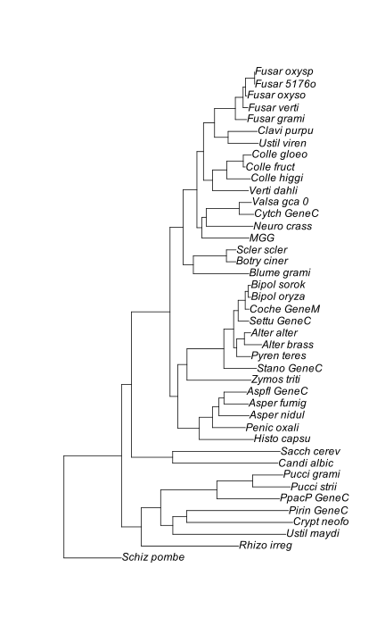
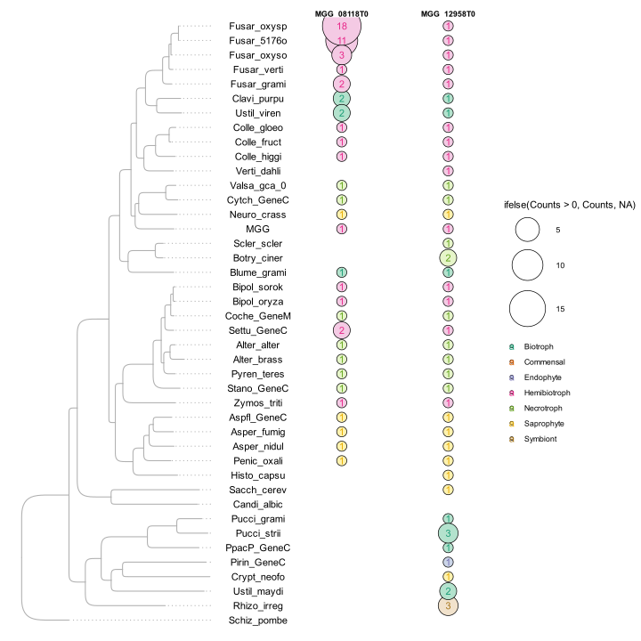

Conservation of Bip1 and Mst12 in other fungi
================
Neha Sahu
23 April,2026

- [**Description**](#description)
- [**Collect Fasta files and Run
  Orthofinder**](#collect-fasta-files-and-run-orthofinder)
- [**Checking conservation of Bip1 and
  Mst12**](#checking-conservation-of-bip1-and-mst12)
  - [Load Required Packages](#load-required-packages)
  - [Load Species Tree](#load-species-tree)
  - [Load Orthogroups GeneCount file](#load-orthogroups-genecount-file)
  - [Load Orthogroups.txt file](#load-orthogroupstxt-file)
  - [Load Lifestyle file](#load-lifestyle-file)
  - [File with results](#file-with-results)
  - [Prepare files for plotting](#prepare-files-for-plotting)
- [**Final Plot**](#final-plot)

# **Description**

Camilla wants to check the orthologs for two Magnaporthe oryzae genes -
MST12 (MGG_12958T0) and BIP1 (MGG_08118T0) - across 40 fungal species
(Nef’s dataset from Pmk1 phosphoproteomics paper -
<https://www.cell.com/cell/fulltext/S0092-8674(24)00402-1>).

To do that,I performed the phylogenetic analysis and ortholog
identification from OrthoFinder results,and visualize the presence and
copy number of these genes in relation to fungal lifestyle and
evolutionary relationships (information collected from the paper.

**Goal:**

To check the evolutionary conservation of MST12 and BIP1 orthologs
across fungal species with diverse lifestyles,and to understand how
their presence correlates with pathogenicity strategies and appressorium
formation.

**Workflow:**  
- Identify the orthogroups containing MST12 and BIP1 from OrthoFinder
analysis across 40+ fungal species. This list of species was used from
Figure 3 in Neftaly Cruz Mireles,2023,Cell
(<https://www.sciencedirect.com/science/article/pii/S0092867424004021?via%3Dihub>)

\- Map the presence,absence,and copy number of these orthologs onto a
species phylogeny generated from OrthoFinder (ran on HPC)

\- Correlate ortholog distribution with fungal lifestyle
(necrotroph,biotroph,saprophyte) and appressorium formation
capabilities - Visualize the relationships using integrated phylogenetic
trees and presence/absence plots

\- Analyze whether the conservation pattern of these genes correlates
with pathogenicity strategies and morphological specializations like
appressorium formation

# **Collect Fasta files and Run Orthofinder**

- Fasta files for proteomes used in this study were downloaded from the
  links provided in **Data S3. Dataset for evolutionary
  analysis**,related to Figure 3 in
  <https://www.sciencedirect.com/science/article/pii/S0092867424004021?via%3Dihub#mmc>.
  A lot of these links didn’t work,so I downloaded them from their
  mentioned sources.

- I could not find the proteomes of 2 species from this list - One of
  them was species F. oxysporum-C.alt from a paper Berasategui et
  al.,Current Biology 2022 - this was shared by Dan MacLean.

- The second is the Candida albicans SC5314 v 22 .. the link in Suppl
  table S1 says it’s in the current directory,and the identifier is
  A22_s07-m01-r182. I couldn’t find this anywhere in the current folder
  at the database
  (<https://www.candidagenome.org/download/sequence/C_albicans_SC5314/Assembly22/current/> -
  showed the proteome file to be 404 not found),so I got this one from
  Dan as well.

- Renamed the fasta headers in proteome files for uniformity (See
  ***`/bin/clean_fasta_headers.html`*** ) and saved the proteomes with
  cleaner headers in a folder called ***`fasta_files`***.

- OrthoFinder was run on the HPC using the following bash script:

``` bash
#!/bin/bash

 
#SBATCH -p tsl-medium
#SBATCH --mem=10000
#SBATCH --cpus-per-task=20
#SBATCH --mail-type=begin,end,fail
#SBATCH --mail-user=neha.sahu@tsl.ac.uk
#SBATCH -o slurm.%j.out
#SBATCH -e slurm.%j.err

source package fc91613f-1095-4f67-b5aa-b86d702b36da #OrthoFinder - 2.5.4

orthofinder -f fasta_files/ -t 20
```

The following files were used for further anlaysis from the OrthoFinder
results folder:

\- Species_Tree/SpeciesTree_rooted.txt

\- Orthogroups/Orthogroups.GeneCount.tsv

\- Orthogroups/Orthogroups.txt

# **Checking conservation of Bip1 and Mst12**

## Load Required Packages

``` r
library(tidyverse)
library(reshape2)
library(ggtree)
library(phylotools)
```

## Load Species Tree

``` r
tree<-read.tree(here("data/raw/001_orthologs/","SpeciesTree_rooted.txt"))

# Ladderize tree for better visualization
LadderizeTree <- function(tree,temp_file="temp",orientation="left"){
  if(file.exists(paste0("./",temp_file))){
    stop("The chosen temporary file exists! Please choose an other temp_file name")
  }
  if(orientation=="left"){
    right <- FALSE
  }else{
    right <- TRUE
  }
  tree_temp <- ladderize(tree,right=right)
  write.tree(tree_temp,file=paste0("./",temp_file,".tre"))
  tree_lad <- read.tree(paste0("./",temp_file,".tre"))
  file.remove(paste0("./",temp_file,".tre"))
  return(tree_lad)
}

tree<-LadderizeTree(tree)
plot(tree) # This is the ladderized species tree
```



## Load Orthogroups GeneCount file

``` r
og_count<-read_tsv(here("data/raw/001_orthologs/","Orthogroups.GeneCount.tsv")) %>%
  melt() %>%
  rename(
         Species=variable,
         Counts=value)
head(og_count)
```

    ##       OG_ID     Species Counts
    ## 1 OG0000000 Alter_alter     10
    ## 2 OG0000001 Alter_alter      0
    ## 3 OG0000002 Alter_alter     25
    ## 4 OG0000003 Alter_alter     30
    ## 5 OG0000004 Alter_alter     85
    ## 6 OG0000005 Alter_alter     83

## Load Orthogroups.txt file

This file will be used to check the Orthogroup ID (starting with
OG00xxx) for any Magnaporthe protein (suffix MGG\_)

``` r
og_prot_id<-read_tsv(here("data/raw/001_orthologs/","Orthogroups.txt")) %>%
  separate_rows(ProtID,sep=", ")

favourite_mgg_id<- c("MGG_12958T0","MGG_08118T0") # these are mst12 and bip1 and T0 suffix is for the transcript

og_id_of_fav_mgg_id<-og_prot_id %>%
  filter(ProtID %in% favourite_mgg_id)
og_id_of_fav_mgg_id
```

    ## # A tibble: 2 × 2
    ##   OG_ID     ProtID     
    ##   <chr>     <chr>      
    ## 1 OG0000937 MGG_08118T0
    ## 2 OG0001868 MGG_12958T0

## Load Lifestyle file

Lifestyle information for the list of species used was sourced from Data
S3. Dataset for evolutionary analysis,related to Figure 3 in
<https://www.sciencedirect.com/science/article/pii/S0092867424004021?via%3Dihub#mmc>

``` r
lf<-read_tsv(here("data/raw/001_orthologs/","Lifestyle.tsv"))
```

## File with results

``` r
og_plot<-og_count %>% 
  right_join(og_id_of_fav_mgg_id,by="OG_ID") %>%
  filter(OG_ID %in% og_id_of_fav_mgg_id$OG_ID & Species!="Total") %>%
  left_join(lf,by="Species")
unique(og_plot$OG_ID)
```

    ## [1] "OG0000937" "OG0001868"

``` r
head(og_plot) #This is the file with gene copy numbers pf mst12 and bip1 in different fungi
```

    ##       OG_ID     Species Counts      ProtID Appresor  Lifestyle
    ## 1 OG0000937 Alter_alter      1 MGG_08118T0  Hyaline Necrotroph
    ## 2 OG0001868 Alter_alter      1 MGG_12958T0  Hyaline Necrotroph
    ## 3 OG0000937 Alter_brass      1 MGG_08118T0  Hyaline Necrotroph
    ## 4 OG0001868 Alter_brass      1 MGG_12958T0  Hyaline Necrotroph
    ## 5 OG0000937 Asper_fumig      1 MGG_08118T0     None Saprophyte
    ## 6 OG0001868 Asper_fumig      1 MGG_12958T0     None Saprophyte

## Prepare files for plotting

Species tree for final figure

``` r
og_tree<-ggtree(tree,color="grey69",layout="roundrect")+geom_tiplab(align=T,color="grey69",size=0.1)
  #geom_tiplab(geom="text",color="grey69") # with species names
og_tree$data$label
```

    ##  [1] "Schiz_pombe" "Rhizo_irreg" "Ustil_maydi" "Crypt_neofo" "Pirin_GeneC"
    ##  [6] "PpacP_GeneC" "Pucci_strii" "Pucci_grami" "Candi_albic" "Sacch_cerev"
    ## [11] "Histo_capsu" "Penic_oxali" "Asper_nidul" "Asper_fumig" "Aspfl_GeneC"
    ## [16] "Zymos_triti" "Stano_GeneC" "Pyren_teres" "Alter_brass" "Alter_alter"
    ## [21] "Settu_GeneC" "Coche_GeneM" "Bipol_oryza" "Bipol_sorok" "Blume_grami"
    ## [26] "Botry_ciner" "Scler_scler" "MGG"         "Neuro_crass" "Cytch_GeneC"
    ## [31] "Valsa_gca_0" "Verti_dahli" "Colle_higgi" "Colle_fruct" "Colle_gloeo"
    ## [36] "Ustil_viren" "Clavi_purpu" "Fusar_grami" "Fusar_verti" "Fusar_oxyso"
    ## [41] "Fusar_5176o" "Fusar_oxysp" ""            "1"           "0.677852"   
    ## [46] "0.696309"    "0.348993"    "0.510067"    "0.968121"    "0.864094"   
    ## [51] "0.362416"    "0.92953"     "0.92953"     "0.347315"    "0.902685"   
    ## [56] "0.874161"    "0.694631"    "0.530201"    "0.592282"    "0.963087"   
    ## [61] "0.75"        "0.409396"    "0.775168"    "0.689597"    "0.838926"   
    ## [66] "0.38255"     "0.659396"    "0.823826"    "0.991611"    "0.810403"   
    ## [71] "0.377517"    "0.263423"    "0.989933"    "0.568792"    "0.734899"   
    ## [76] "0.85906"     "0.944631"    "0.780201"    "0.909396"    "0.932886"   
    ## [81] "0.860738"    "0.75"        "0.64094"

Order of species to be arranged in the final plots

``` r
order<-c("Schiz_pombe","Rhizo_irreg","Ustil_maydi","Crypt_neofo","Pirin_GeneC",
         "PpacP_GeneC","Pucci_strii","Pucci_grami","Candi_albic","Sacch_cerev",
         "Histo_capsu","Penic_oxali","Asper_nidul","Asper_fumig","Aspfl_GeneC",
         "Zymos_triti","Stano_GeneC","Pyren_teres","Alter_brass","Alter_alter",
         "Settu_GeneC","Coche_GeneM","Bipol_oryza","Bipol_sorok","Blume_grami",
         "Botry_ciner","Scler_scler","MGG","Neuro_crass","Cytch_GeneC",
         "Valsa_gca_0","Verti_dahli","Colle_higgi","Colle_fruct","Colle_gloeo",
         "Ustil_viren","Clavi_purpu","Fusar_grami","Fusar_verti","Fusar_oxyso",
         "Fusar_5176o","Fusar_oxysp")
```

``` r
counts_bar<- ggplot(og_plot)+
    geom_bar(aes(y=factor(Species,order),x=Counts,fill=Lifestyle),stat="identity") +
  facet_grid(~ ProtID,scales="free") +
  labs(y="",x="Number of orthologs in Magnaporthe") +
  theme_bw()+
  theme(axis.text.x=element_text(angle=45,vjust=0.5,hjust=1,size=10),
        strip.text=element_text(face="bold"),
        strip.background=element_blank())+
  scale_fill_brewer(palette="Pastel2",name=NULL)
counts_bar
```

``` r
counts_points <- ggplot(og_plot) + 
  geom_point(aes(y=factor(Species,order),x=ProtID,size=ifelse(Counts > 0,Counts,NA),
                 fill=ifelse(Counts > 0,Lifestyle,Lifestyle)),
             shape=21,color="black") + 
  facet_grid(~ ProtID,scales="free") + 
  geom_text(aes(y=factor(Species,order),
                x=ProtID,
                label=ifelse(Counts>0,Counts,NA),
                color=ifelse(Counts>0,Lifestyle,Lifestyle)))+
  labs(y="",x="") + 
  theme_void() + 
  theme(axis.text.y=element_text(),
        strip.text=element_text(face="bold"),
        strip.background=element_blank()) + 
  scale_fill_brewer(palette="Pastel2",name=NULL) +
  scale_color_brewer(palette="Dark2",name=NULL) +
  scale_size_continuous(range=c(5,20))
```

# **Final Plot**

``` r
og_tree+counts_points
```



``` r
sessionInfo()
```

    ## R version 4.3.1 (2023-06-16)
    ## Platform: aarch64-apple-darwin20 (64-bit)
    ## Running under: macOS 15.7.5
    ## 
    ## Matrix products: default
    ## BLAS:   /Library/Frameworks/R.framework/Versions/4.3-arm64/Resources/lib/libRblas.0.dylib 
    ## LAPACK: /Library/Frameworks/R.framework/Versions/4.3-arm64/Resources/lib/libRlapack.dylib;  LAPACK version 3.11.0
    ## 
    ## locale:
    ## [1] en_US.UTF-8/en_US.UTF-8/en_US.UTF-8/C/en_US.UTF-8/en_US.UTF-8
    ## 
    ## time zone: Europe/London
    ## tzcode source: internal
    ## 
    ## attached base packages:
    ## [1] stats     graphics  grDevices utils     datasets  methods   base     
    ## 
    ## other attached packages:
    ##  [1] phylotools_0.2.2 ape_5.8-1        ggtree_3.10.1    reshape2_1.4.4  
    ##  [5] lubridate_1.9.4  forcats_1.0.1    stringr_1.6.0    dplyr_1.1.4     
    ##  [9] purrr_1.0.4      readr_2.1.5      tidyr_1.3.1      tibble_3.3.0    
    ## [13] ggplot2_3.5.2    tidyverse_2.0.0  here_1.0.2      
    ## 
    ## loaded via a namespace (and not attached):
    ##  [1] yulab.utils_0.2.0  utf8_1.2.6         generics_0.1.4     ggplotify_0.1.3   
    ##  [5] stringi_1.8.7      lattice_0.22-7     hms_1.1.4          digest_0.6.37     
    ##  [9] magrittr_2.0.3     evaluate_1.0.5     grid_4.3.1         timechange_0.3.0  
    ## [13] RColorBrewer_1.1-3 fastmap_1.2.0      jsonlite_2.0.0     rprojroot_2.1.1   
    ## [17] plyr_1.8.9         aplot_0.2.9        scales_1.4.0       lazyeval_0.2.2    
    ## [21] cli_3.6.5          crayon_1.5.3       rlang_1.1.6        bit64_4.6.0-1     
    ## [25] tidytree_0.4.6     withr_3.0.2        yaml_2.3.10        tools_4.3.1       
    ## [29] parallel_4.3.1     tzdb_0.5.0         gridGraphics_0.5-1 vctrs_0.6.5       
    ## [33] R6_2.6.1           lifecycle_1.0.4    bit_4.6.0          ggfun_0.2.0       
    ## [37] fs_1.6.6           vroom_1.6.5        treeio_1.26.0      archive_1.1.12    
    ## [41] pkgconfig_2.0.3    pillar_1.11.1      gtable_0.3.6       glue_1.8.0        
    ## [45] Rcpp_1.1.0         xfun_0.52          tidyselect_1.2.1   rstudioapi_0.17.1 
    ## [49] knitr_1.50         dichromat_2.0-0.1  farver_2.1.2       patchwork_1.3.2   
    ## [53] htmltools_0.5.8.1  nlme_3.1-168       labeling_0.4.3     rmarkdown_2.29    
    ## [57] compiler_4.3.1
