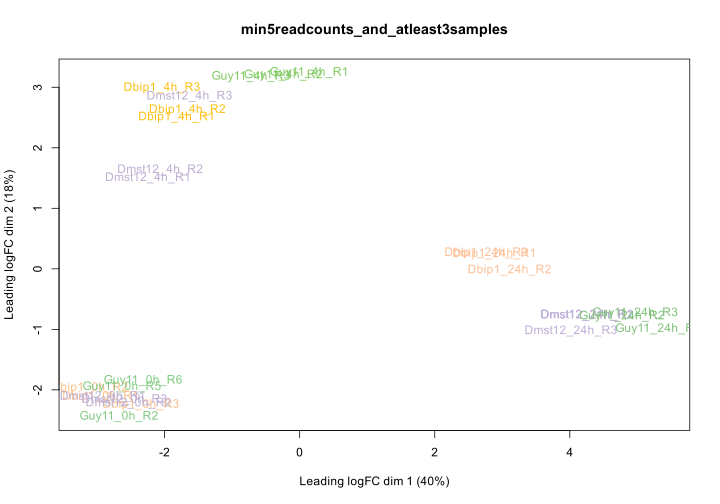
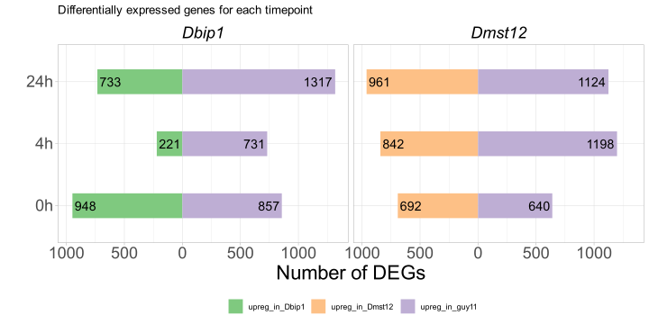

RNASeq analysis for Guy11 and Dbip1 and Dmst12
================
Neha Sahu
23 April,2026

- [Description](#description)
  - [GoHREP](#gohrep)
  - [RNA Samples](#rna-samples)
  - [Quality control](#quality-control)
  - [Read Mapping](#read-mapping)
- [**Differentially Expressed Genes
  (DEGs)**](#differentially-expressed-genes-degs)
  - [Load Libraries](#load-libraries)
  - [Load Kallisto Results](#load-kallisto-results)
  - [DEG calculations](#deg-calculations)
- [**0h**](#0h)
  - [For 0h guy11_vs_Dbip1](#for-0h-guy11_vs_dbip1)
  - [For 0h guy11_vs_Dmst12](#for-0h-guy11_vs_dmst12)
- [**4h**](#4h)
  - [For 4h guy11_vs_Dbip1](#for-4h-guy11_vs_dbip1)
  - [For 4h guy11_vs_Dmst12](#for-4h-guy11_vs_dmst12)
- [**24h**](#24h)
  - [For 24h guy11_vs_Dbip1](#for-24h-guy11_vs_dbip1)
  - [For 24h guy11_vs_Dmst12](#for-24h-guy11_vs_dmst12)
- [**Merged DEGs File**](#merged-degs-file)
- [DEG Classification in Guy11](#deg-classification-in-guy11)
- [**Total Number of DEGs**](#total-number-of-degs)

# Description

Lab notes for RNA-Seq data analysis and differential gene expression in
*Magnaporthe oryzae* wild-type (Guy11) compared to null mutant strains
(Dbip1 and Dmst12) across a time-course experiment. The analysis
identifies differentially expressed genes at multiple timepoints (0h,
4h,and 24h),visualizes results through volcano plots,and identifies key
genes with altered expression in mutant backgrounds.

## GoHREP

**Goal:**

To identify genes differentially regulated in M. oryzae null mutant
strains (Dbip1,Dmst12) compared to wild-type Guy11 across multiple
timepoints to understand processes regulated by these genes during
fungal development and potential infection processes.

**Hypothesis:**  
*Camilla* has a hypothesis that bip1 and mst12 are co-regulated. By
checking the gene regulation in deletion mutants of bip1 and mst12 at
different timepoints,we can see if that’s the case or not.

**Rationale:**  
Understanding how key regulatory genes influence global gene expression
patterns can reveal their functional roles and regulatory networks. By
comparing transcriptional profiles of wild-type and mutant strains
across different timepoints,we can identify genes and pathways
specifically regulated by bip1,mst12.

**Experimental plan:**

Analyze RNA-seq data from wild-type Guy11 and null mutant strains
(Dbip1,Dmst12) at three timepoints (0h,4h,and 24h)

- Perform quality control of RNA-seq data using FastQC/MultiQC to assess
  sequencing quality metrics

- Process raw reads with Trimmomatic to remove adapters and low-quality
  sequences

- Map processed reads to the *M. oryzae* reference transcriptome using
  Kallisto for transcript quantification

- Identify differentially expressed genes (DEGs) using edgeR,with
  thresholds of \|log2FC\| ≥ 1 and adjusted p-value ≤ 0.05

- Visualize differential expression through volcano plots, highlighting
  the top 10 or 15 most significantly up- and down-regulated genes

## RNA Samples

| Strain         | 0h       | 4h       | 24h      |
|----------------|----------|----------|----------|
| **Guy11 (WT)** | R2,R5,R6 | R1,R2,R3 | R1,R2,R3 |
| **Dbip1**      | R1,R2,R3 | R1,R2,R3 | R1,R2,R3 |
| **Dmst12**     | R1,R2,R3 | R1,R2,R3 | R1,R2,R3 |

## Quality control

**- FastQC and MultiQC with raw files**

The raw fastq files from Novogene are located on the HPC (saved by
Camilla). FastQC and MultiQC can be sourced from
`scripts/002_rna_seq/001_fastqc_multiqc.sh`

**- Trimmomatic to remove adapters**

The QC shows that the fastq files has adapters that need to be trimmed.
I used trimmomatic to trim the adapter regions and low quality
sequences. Script used can be sourced from
`scripts/002_rna_seq/002_trim.sh`. The trimmed read files were again
processed though FastQC/MultiQC to confirm the results. Script is
located at `scripts/002_rna_seq/003_trimmed_fastqc_multiqc.sh`

QC of all the samples look good - per sequence and mean quality score
are in the green region (\>=35) and GC distribution shows a nice bell
shape - proceed with read mapping.

## Read Mapping

**- Kallisto (pseudoalignment)**

**Kallisto** is a program for quantifying abundances of transcripts from
bulk and single-cell RNA-Seq data,or more generally of target sequences
using high-throughput sequencing reads.

**NOTE: Kallisto can ONLY use transcripts file (cDNA) and not the whole
genome fasta.** Source: <https://pachterlab.github.io/kallisto/about>.
The script used to run Kallisto can be sourced from
`scripts/002_rna_seq/004_fungal_kallisto_trimmed.sh`

# **Differentially Expressed Genes (DEGs)**

## Load Libraries

``` r
library(tidyverse)
library(edgeR)
library(limma)
library(ggrepel)
```

## Load Kallisto Results

Specify where the kallisto results are stored and create a read counts
file: tpm table - non log transformed and no addition of any values (eg.
0.05) to avoid DIV0

``` r
dirs <- list.dirs(here("data/interim/", "kallisto_output_fungal"),full.names=TRUE,recursive=FALSE)

# Initialize an empty list to store data frames
est_counts_list <- list()

# Loop through each directory and read the abundance.tsv file
for (dir in dirs) {
  file_path <- file.path(dir,"abundance.tsv")
  if (file.exists(file_path)) {
    sample_name <- basename(dir)  # Use directory name as sample name
    est_counts_data <- read.delim(file_path,stringsAsFactors=FALSE)
    
    # Extract the est_counts values and transcript/gene names
    est_counts_data <- est_counts_data %>%
      select(target_id,est_counts) %>%
      dplyr::rename(!!sample_name := est_counts)  # dplyr::rename the est_counts column with the sample name
    
    est_counts_list[[sample_name]] <- est_counts_data
  }
}

# Merge all data frames by 'target_id' (gene or transcript name)
est_counts_table <- Reduce(function(x,y) merge(x,y,by="target_id",all=TRUE),est_counts_list)

# Create a TPM table for further use
tpm <- est_counts_table %>%
  pivot_longer(-target_id,names_to="sample",values_to="value") %>%
  mutate(sample_group=gsub("_R[0-9]+$", "",sample)) %>%
  group_by(target_id,sample_group) %>%
  summarise(avg_value=mean(value,na.rm=TRUE),.groups="drop") %>%
  pivot_wider(names_from=sample_group,values_from=avg_value)
#save TPM table
save_data(tpm,"TPM_table",format="csv")

# Remove lowly expressed genes - here I removed genes that do not have any read count in less than or atleast 3 samples.. also the sum of max reads should exceed 5
counts <- est_counts_table %>%
  column_to_rownames(var="target_id") %>%  # Convert the target_id column into row names
  mutate(
    max=max(across(everything()),na.rm=TRUE), # Calculate the max for each row
    count_gt_zero=rowSums(across(everything()) > 0)  # Count the number of samples with values > 0
  ) %>%
  filter(count_gt_zero > 3 & max > 5) %>%  # Filter for rows with at least 3 samples > 0 and sum > 3
  select(-max,-count_gt_zero)  # Remove temporary columns


length(est_counts_table$Guy11_0h_R2) #total genes
```

    ## [1] 13307

``` r
length(counts$Guy11_0h_R2) # after removing lowly expressed genes
```

    ## [1] 12405

## DEG calculations

``` r
dge <- DGEList(counts)
dge <- calcNormFactors(dge) # perform scale normalization,adjusting for differences
colnames(counts)
```

    ##  [1] "Dbip1_0h_R1"   "Dbip1_0h_R2"   "Dbip1_0h_R3"   "Dbip1_24h_R1" 
    ##  [5] "Dbip1_24h_R2"  "Dbip1_24h_R3"  "Dbip1_4h_R1"   "Dbip1_4h_R2"  
    ##  [9] "Dbip1_4h_R3"   "Dmst12_0h_R1"  "Dmst12_0h_R2"  "Dmst12_0h_R3" 
    ## [13] "Dmst12_24h_R1" "Dmst12_24h_R2" "Dmst12_24h_R3" "Dmst12_4h_R1" 
    ## [17] "Dmst12_4h_R2"  "Dmst12_4h_R3"  "Guy11_0h_R2"   "Guy11_0h_R5"  
    ## [21] "Guy11_0h_R6"   "Guy11_24h_R1"  "Guy11_24h_R2"  "Guy11_24h_R3" 
    ## [25] "Guy11_4h_R1"   "Guy11_4h_R2"   "Guy11_4h_R3"

``` r
#group as replicates together
group=c(rep("Dbip1_0h",3),rep("Dbip1_24h",3),rep("Dbip1_4h",3),
        rep("Dmst12_0h",3),rep("Dmst12_24h",3),rep("Dmst12_4h",3),
        rep("Guy11_0h",3),rep("Guy11_24h",3),rep("Guy11_4h",3))
design=model.matrix(~0+group)
colnames(design)=gsub("", "",colnames(design))
colnames(design)
```

    ## [1] "groupDbip1_0h"   "groupDbip1_24h"  "groupDbip1_4h"   "groupDmst12_0h" 
    ## [5] "groupDmst12_24h" "groupDmst12_4h"  "groupGuy11_0h"   "groupGuy11_24h" 
    ## [9] "groupGuy11_4h"

``` r
v=voom(dge,design,plot=TRUE,normalize.method="none")
```


``` r
#MDS plot
cols<-c(rep("#fdc086",3),rep("#fdc096",3),rep("#fdc016",3),
        rep("#beaed4",3),rep("#beaed9",3),rep("#beaed0",3),
        rep("#7fc97f",3),rep("#7fc17a",3),rep("#7fc95f",3)) 

plotMDS(v,labels=colnames(v),main="min5readcounts_and_atleast3samples",cex=1,col=cols)
```



``` r
fit<-lmFit(v,design) # fits row-wise linear models (this will need the voom output file and the design matrix)
colnames(design)
```

    ## [1] "groupDbip1_0h"   "groupDbip1_24h"  "groupDbip1_4h"   "groupDmst12_0h" 
    ## [5] "groupDmst12_24h" "groupDmst12_4h"  "groupGuy11_0h"   "groupGuy11_24h" 
    ## [9] "groupGuy11_4h"

``` r
#define comparisons as contrast matrices
contrast.matrix= makeContrasts(groupGuy11_0h-groupDbip1_0h,#1
                               groupGuy11_0h - groupDmst12_0h,#2
                               groupGuy11_4h - groupDbip1_4h ,#3
                               groupGuy11_4h - groupDmst12_4h ,#4
                               groupGuy11_24h - groupDbip1_24h,#5
                               groupGuy11_24h - groupDmst12_24h,#6
                               levels=design) # more comparisons can be provided here,based on the design
fit2= contrasts.fit(fit,contrast.matrix)
fit2= eBayes(fit2) # empirical Bayes statistics for differential expression
```

# **0h**

## For 0h guy11_vs_Dbip1

``` r
# see contrast matrix. in the example,coef=1 means first comparison (group1-group2 above)
complete_table=topTable(fit2,coef=1,number=nrow(v)) #make sure to change "coeff" is changed each time for each comparison
guy11_vs_Dbip1_0h <- complete_table %>%
  mutate(target_id=paste0(rownames(complete_table)),
         DEG_status=case_when(
    logFC >= 1 & adj.P.Val <= 0.05 ~ "upreg_in_guy11",
    logFC <= -1 & adj.P.Val <= 0.05 ~ "downreg_in_guy11",
    TRUE ~ "Not_DEG"))
table(guy11_vs_Dbip1_0h$DEG_status)
```

    ## 
    ## downreg_in_guy11          Not_DEG   upreg_in_guy11 
    ##              948            10600              857

``` r
#save DEGs
save_data(guy11_vs_Dbip1_0h,"guy11_vs_Dbip1_0h",format="tsv")

#volcano plot
comp_table<- complete_table %>%
   mutate(GeneID=paste0(rownames(complete_table)))
volcano_data <- comp_table %>%
  mutate(
    significance=case_when(
      logFC >= 1 & adj.P.Val <= 0.05  ~ "Upreg in Guy11",
      logFC <= -1 & adj.P.Val <= 0.05 ~ "Upreg in Dbip1",
      TRUE ~ "NS"
    ),
    GeneID=gsub("T[0-9]", "",GeneID)
  )


top10_up <- volcano_data %>%
  filter(significance == "Upreg in Guy11") %>%
  slice_min(order_by=-logFC,n=10)

top10_down <- volcano_data %>%
  filter(significance == "Upreg in Dbip1") %>%
  slice_min(order_by=logFC,n=10)

top_genes <- bind_rows(top10_up,top10_down)

volcano_data <- volcano_data %>%
  mutate(label=ifelse(GeneID %in% top_genes$GeneID,as.character(GeneID),NA))

ggplot(volcano_data,aes(x=logFC,y=-log10(adj.P.Val))) +
  geom_point(aes(color=significance,alpha=0.5),shape=1,size=1) +
  geom_vline(xintercept=c(-1,1),linetype="dashed",color="red") +
  geom_hline(yintercept=-log10(0.05),linetype="dashed",color="red") +
  scale_color_manual(values=c("Upreg in Guy11"="#7fc97f", "Upreg in Dbip1"="#fdc086", "NS"="grey80")) +
  geom_text_repel(aes(label=label,color=significance),
                  size=5,
                  #box.padding=0.5,
                  max.overlaps= 10) + 
  labs(title="guy11_vs_Dbip1_0h",
    x="Log2 Fold Change",
    y="-Log10 Adjusted P-Value",
    color="Expression") +
  theme_bw(base_size=14) +   theme(legend.position="bottom") +
  theme(legend.position="bottom")
```


## For 0h guy11_vs_Dmst12

``` r
# see contrast matrix. in the example,coef=1 means first comparison (group1-group2 above)
complete_table=topTable(fit2,coef=2,number=nrow(v)) #make sure to change "coeff" is changed each time for each comparison

guy11_vs_Dmst12_0h <- complete_table %>%
  mutate(target_id=paste0(rownames(complete_table)),
         DEG_status=case_when(
    logFC >= 1 & adj.P.Val <= 0.05 ~ "upreg_in_guy11",
    logFC <= -1 & adj.P.Val <= 0.05 ~ "downreg_in_guy11",
    TRUE ~ "Not_DEG"))


table(guy11_vs_Dmst12_0h$DEG_status)
```

    ## 
    ## downreg_in_guy11          Not_DEG   upreg_in_guy11 
    ##              692            11073              640

``` r
# save DEGs
save_data(guy11_vs_Dmst12_0h,"guy11_vs_Dmst12_0h",format="tsv")

# volcano plot
comp_table<- complete_table %>%
   mutate(GeneID=paste0(rownames(complete_table)))
#volcano plot
comp_table<- complete_table %>%
   mutate(GeneID=paste0(rownames(complete_table)))
volcano_data <- comp_table %>%
  mutate(
    significance=case_when(
      logFC >= 1 & adj.P.Val <= 0.05  ~ "Upreg in Guy11",
      logFC <= -1 & adj.P.Val <= 0.05 ~ "Upreg in Dmst12",
      TRUE ~ "NS"
    ),
    GeneID=gsub("T[0-9]", "",GeneID)
  )


top10_up <- volcano_data %>%
  filter(significance == "Upreg in Guy11") %>%
  slice_min(order_by=-logFC,n=10)

top10_down <- volcano_data %>%
  filter(significance == "Upreg in Dmst12") %>%
  slice_min(order_by=logFC,n=10)

top_genes <- bind_rows(top10_up,top10_down)

volcano_data <- volcano_data %>%
  mutate(label=ifelse(GeneID %in% top_genes$GeneID,as.character(GeneID),NA))

ggplot(volcano_data,aes(x=logFC,y=-log10(adj.P.Val))) +
  geom_point(aes(color=significance,alpha=0.5),shape=1,size=1) +
  geom_vline(xintercept=c(-1,1),linetype="dashed",color="red") +
  geom_hline(yintercept=-log10(0.05),linetype="dashed",color="red") +
  scale_color_manual(values=c("Upreg in Guy11"="#7fc97f", "Upreg in Dmst12"="#beaed4", "NS"="grey80")) +
  geom_text_repel(aes(label=label,color=significance),
                  size=5,
                  #box.padding=0.5,
                  max.overlaps= 10) + 
  geom_text_repel(aes(label=label,color=significance),
                  size=5,
                  #box.padding=0.5,
                  max.overlaps= 10) + 
  labs(title="guy11_vs_Dmst12_0h",
    x="Log2 Fold Change",
    y="-Log10 Adjusted P-Value",
    color="Expression") +
  theme_bw(base_size=14) +   theme(legend.position="bottom")
```


# **4h**

## For 4h guy11_vs_Dbip1

``` r
# see contrast matrix. in the example,coef=1 means first comparison (group1-group2 above)
complete_table=topTable(fit2,coef=3,number=nrow(v)) #make sure to change "coeff" is changed each time for each comparison
guy11_vs_Dbip1_4h <- complete_table %>%
  mutate(target_id=paste0(rownames(complete_table)),
         DEG_status=case_when(
    logFC >= 1 & adj.P.Val <= 0.05 ~ "upreg_in_guy11",
    logFC <= -1 & adj.P.Val <= 0.05 ~ "downreg_in_guy11",
    TRUE ~ "Not_DEG"))
table(guy11_vs_Dbip1_4h$DEG_status)
```

    ## 
    ## downreg_in_guy11          Not_DEG   upreg_in_guy11 
    ##              221            11453              731

``` r
#save DEGs
save_data(guy11_vs_Dbip1_4h,"guy11_vs_Dbip1_4h",format="tsv")

#volcano plot
comp_table<- complete_table %>%
   mutate(GeneID=paste0(rownames(complete_table)))
#volcano plot
comp_table<- complete_table %>%
   mutate(GeneID=paste0(rownames(complete_table)))
volcano_data <- comp_table %>%
  mutate(
    significance=case_when(
      logFC >= 1 & adj.P.Val <= 0.05  ~ "Upreg in Guy11",
      logFC <= -1 & adj.P.Val <= 0.05 ~ "Upreg in Dbip1",
      TRUE ~ "NS"
    ),
    GeneID=gsub("T[0-9]", "",GeneID)
  )


top10_up <- volcano_data %>%
  filter(significance == "Upreg in Guy11") %>%
  slice_min(order_by=-logFC,n=10)

top10_down <- volcano_data %>%
  filter(significance == "Upreg in Dbip1") %>%
  slice_min(order_by=logFC,n=10)

top_genes <- bind_rows(top10_up,top10_down)

volcano_data <- volcano_data %>%
  mutate(label=ifelse(GeneID %in% top_genes$GeneID,as.character(GeneID),NA))

ggplot(volcano_data,aes(x=logFC,y=-log10(adj.P.Val))) +
  geom_point(aes(color=significance,alpha=0.5),shape=1,size=1) +
  geom_vline(xintercept=c(-1,1),linetype="dashed",color="red") +
  geom_hline(yintercept=-log10(0.05),linetype="dashed",color="red") +
  scale_color_manual(values=c("Upreg in Guy11"="#7fc97f", "Upreg in Dbip1"="#fdc086", "NS"="grey80")) +
  geom_text_repel(aes(label=label,color=significance),
                  size=5,
                  #box.padding=0.5,
                  max.overlaps= 10) + 
  geom_text_repel(aes(label=label,color=significance),
                  size=5,
                  #box.padding=0.5,
                  max.overlaps= 10) + 
  labs(title="guy11_vs_Dbip1_4h",
    x="Log2 Fold Change",
    y="-Log10 Adjusted P-Value",
    color="Expression") +
  theme_bw(base_size=14) +   theme(legend.position="bottom")
```


## For 4h guy11_vs_Dmst12

``` r
# see contrast matrix. in the example,coef=1 means first comparison (group1-group2 above)
complete_table=topTable(fit2,coef=4,number=nrow(v)) #make sure to change "coeff" is changed each time for each comparison

guy11_vs_Dmst12_4h <- complete_table %>%
  mutate(target_id=paste0(rownames(complete_table)),
         DEG_status=case_when(
    logFC >= 1 & adj.P.Val <= 0.05 ~ "upreg_in_guy11",
    logFC <= -1 & adj.P.Val <= 0.05 ~ "downreg_in_guy11",
    TRUE ~ "Not_DEG"))


table(guy11_vs_Dmst12_4h$DEG_status)
```

    ## 
    ## downreg_in_guy11          Not_DEG   upreg_in_guy11 
    ##              842            10365             1198

``` r
# save DEGs
save_data(guy11_vs_Dmst12_4h,"guy11_vs_Dmst12_4h",format="tsv")

# volcano plot
comp_table<- complete_table %>%
   mutate(GeneID=paste0(rownames(complete_table)))
volcano_data <- comp_table %>%
  mutate(
    significance=case_when(
      logFC >= 1 & adj.P.Val <= 0.05  ~ "Upreg in Guy11",
      logFC <= -1 & adj.P.Val <= 0.05 ~ "Upreg in Dmst12",
      TRUE ~ "NS"
    ),
    GeneID=gsub("T[0-9]", "",GeneID)
  )


top10_up <- volcano_data %>%
  filter(significance == "Upreg in Guy11") %>%
  slice_min(order_by=-logFC,n=10)

top10_down <- volcano_data %>%
  filter(significance == "Upreg in Dmst12") %>%
  slice_min(order_by=logFC,n=10)

top_genes <- bind_rows(top10_up,top10_down)

volcano_data <- volcano_data %>%
  mutate(label=ifelse(GeneID %in% top_genes$GeneID,as.character(GeneID),NA))

ggplot(volcano_data,aes(x=logFC,y=-log10(adj.P.Val))) +
  geom_point(aes(color=significance,alpha=0.5),shape=1,size=1) +
  geom_vline(xintercept=c(-1,1),linetype="dashed",color="red") +
  geom_hline(yintercept=-log10(0.05),linetype="dashed",color="red") +
  scale_color_manual(values=c("Upreg in Guy11"="#7fc97f", "Upreg in Dmst12"="#beaed4", "NS"="grey80")) +
  geom_text_repel(aes(label=label,color=significance),
                  size=5,
                  #box.padding=0.5,
                  max.overlaps= 10) + 
  labs(title="guy11_vs_Dmst12_4h",
    x="Log2 Fold Change",
    y="-Log10 Adjusted P-Value",
    color="Expression") +
  theme_bw(base_size=14) +   theme(legend.position="bottom")
```


# **24h**

## For 24h guy11_vs_Dbip1

``` r
# see contrast matrix. in the example,coef=1 means first comparison (group1-group2 above)
complete_table=topTable(fit2,coef=5,number=nrow(v)) #make sure to change "coeff" is changed each time for each comparison
guy11_vs_Dbip1_24h <- complete_table %>%
  mutate(target_id=paste0(rownames(complete_table)),
         DEG_status=case_when(
    logFC >= 1 & adj.P.Val <= 0.05 ~ "upreg_in_guy11",
    logFC <= -1 & adj.P.Val <= 0.05 ~ "downreg_in_guy11",
    TRUE ~ "Not_DEG"))
table(guy11_vs_Dbip1_24h$DEG_status)
```

    ## 
    ## downreg_in_guy11          Not_DEG   upreg_in_guy11 
    ##              733            10355             1317

``` r
#save DEGs
save_data(guy11_vs_Dbip1_24h,"guy11_vs_Dbip1_24h",format="tsv")

#volcano plot
comp_table<- complete_table %>%
   mutate(GeneID=paste0(rownames(complete_table)))

#volcano plot
comp_table<- complete_table %>%
   mutate(GeneID=paste0(rownames(complete_table)))
volcano_data <- comp_table %>%
  mutate(
    significance=case_when(
      logFC >= 1 & adj.P.Val <= 0.05  ~ "Upreg in Guy11",
      logFC <= -1 & adj.P.Val <= 0.05 ~ "Upreg in Dbip1",
      TRUE ~ "NS"
    ),
    GeneID=gsub("T[0-9]", "",GeneID)
  )


top10_up <- volcano_data %>%
  filter(significance == "Upreg in Guy11") %>%
  slice_min(order_by=-logFC,n=10)

top10_down <- volcano_data %>%
  filter(significance == "Upreg in Dbip1") %>%
  slice_min(order_by=logFC,n=10)

top_genes <- bind_rows(top10_up,top10_down)

volcano_data <- volcano_data %>%
  mutate(label=ifelse(GeneID %in% top_genes$GeneID,as.character(GeneID),NA))

ggplot(volcano_data,aes(x=logFC,y=-log10(adj.P.Val))) +
  geom_point(aes(color=significance,alpha=0.5),shape=1,size=1) +
  geom_vline(xintercept=c(-1,1),linetype="dashed",color="red") +
  geom_hline(yintercept=-log10(0.05),linetype="dashed",color="red") +
  scale_color_manual(values=c("Upreg in Guy11"="#7fc97f", "Upreg in Dbip1"="#fdc086", "NS"="grey80")) +
  geom_text_repel(aes(label=label,color=significance),
                  size=5,
                  #box.padding=0.5,
                  max.overlaps= 10) + 
  labs(title="guy11_vs_Dbip1_24h",
    x="Log2 Fold Change",
    y="-Log10 Adjusted P-Value",
    color="Expression") +
  theme_bw(base_size=14) +   theme(legend.position="bottom")
```


## For 24h guy11_vs_Dmst12

``` r
# see contrast matrix. in the example,coef=1 means first comparison (group1-group2 above)
complete_table=topTable(fit2,coef=6,number=nrow(v)) #make sure to change "coeff" is changed each time for each comparison

guy11_vs_Dmst12_24h <- complete_table %>%
  mutate(target_id=paste0(rownames(complete_table)),
         DEG_status=case_when(
    logFC >= 1 & adj.P.Val <= 0.05 ~ "upreg_in_guy11",
    logFC <= -1 & adj.P.Val <= 0.05 ~ "downreg_in_guy11",
    TRUE ~ "Not_DEG"))


table(guy11_vs_Dmst12_24h$DEG_status)
```

    ## 
    ## downreg_in_guy11          Not_DEG   upreg_in_guy11 
    ##              961            10320             1124

``` r
# save DEGs
save_data(guy11_vs_Dmst12_24h,"guy11_vs_Dmst12_24h",format="tsv")

# volcano plot
comp_table<- complete_table %>%
   mutate(GeneID=paste0(rownames(complete_table)))
volcano_data <- comp_table %>%
  mutate(
    significance=case_when(
      logFC >= 1 & adj.P.Val <= 0.05  ~ "Upreg in Guy11",
      logFC <= -1 & adj.P.Val <= 0.05 ~ "Upreg in Dmst12",
      TRUE ~ "NS"
    ),
    GeneID=gsub("T[0-9]", "",GeneID)
  )


top10_up <- volcano_data %>%
  filter(significance == "Upreg in Guy11") %>%
  slice_min(order_by=-logFC,n=10)

top10_down <- volcano_data %>%
  filter(significance == "Upreg in Dmst12") %>%
  slice_min(order_by=logFC,n=10)

top_genes <- bind_rows(top10_up,top10_down)

volcano_data <- volcano_data %>%
  mutate(label=ifelse(GeneID %in% top_genes$GeneID,as.character(GeneID),NA))

ggplot(volcano_data,aes(x=logFC,y=-log10(adj.P.Val))) +
  geom_point(aes(color=significance,alpha=0.5),shape=1,size=1) +
  geom_vline(xintercept=c(-1,1),linetype="dashed",color="red") +
  geom_hline(yintercept=-log10(0.05),linetype="dashed",color="red") +
  scale_color_manual(values=c("Upreg in Guy11"="#7fc97f", "Upreg in Dmst12"="#beaed4", "NS"="grey80")) +
  geom_text_repel(aes(label=label,color=significance),
                  size=5,
                  #box.padding=0.5,
                  max.overlaps= 10) + 
  labs(title="guy11_vs_Dmst12_24h",
    x="Log2 Fold Change",
    y="-Log10 Adjusted P-Value",
    color="Expression") +
  theme_bw(base_size=14) +   theme(legend.position="bottom")
```


# **Merged DEGs File**

``` r
# Find all DEG files
degs <- list.files(here("data/results/002_rna_seq"),pattern="\\.tsv$",full.names=TRUE)

# Function to read each .tsv file and add a "comparison" column based on the filename
read_and_add_comparison <- function(file) {
  # Read the .tsv file
  data <- read_tsv(file)
  # Extract the file name without the path and extension
  comparison <- tools::file_path_sans_ext(basename(file))
  # Add the "comparison" column
  data <- data %>% mutate(Comparison=comparison)
  return(data)
}

# Use map_dfr to read and bind all .tsv files together
merged_data <- map_dfr(degs,read_and_add_comparison)

# Use the save_data helper function to save the merged data
save_data(merged_data,"merged_DEGs_guy11_vs_Dbip1_Dmst12",format="csv")
```

# DEG Classification in Guy11

``` r
# List of any genes of interest - here I'm using guy11,bip1 and mst12 DEGs to test with
degs<- merged_data %>%
  select(-any_of("Id")) %>%  # Remove any existing Id column first
  dplyr::rename(Id=target_id) %>%
  select(Id,Comparison,DEG_status) %>%
  filter(DEG_status!="Not_DEG") %>%
  mutate(
    Id=str_remove(Id,"T[0-9]"),
    sample=word(Comparison,3,3,"_"),
    time=word(Comparison,4,4,"_"),
    type=paste0(DEG_status,"_",time)) %>%
  #filter(sample!="tbip1") %>%
  select(Id,sample,type) %>%
  group_by(Id,type) %>%
  summarise(across(everything(),~ toString(unique(.))),.groups='drop') %>%
  ungroup() %>%
  pivot_wider(names_from=type,
              values_from=sample,
              values_fill="Not_DEG")
save_data(degs,"degs_in_guy11",format="csv")
```

# **Total Number of DEGs**

``` r
degs_filt <- merged_data %>%
  select(target_id,Comparison,DEG_status) %>%
  filter(DEG_status!="Not_DEG") %>%
  mutate(time=word(Comparison,sep="_",4,4),
         sample=word(Comparison,sep="_",3,3))

comm_degs<-degs_filt %>%
  mutate(time_sample=paste0(time,"_",sample)) %>%
  select(target_id,DEG_status,time_sample) %>%
  pivot_wider(names_from=time_sample,
              values_from=DEG_status)

#summary count of target_ids by time and DEG_status
deg_summary <- degs_filt %>%
  group_by(time,sample,DEG_status) %>%
  summarise(count=n()) %>%
  ungroup()

deg_summary <- deg_summary %>%
  mutate(count=ifelse(DEG_status == "downreg_in_guy11",-count,count),
         DEG_status=ifelse(count<=0,paste0("upreg_in_",sample),DEG_status))

ggplot(deg_summary,aes(y=factor(time,levels=c("0h", "4h", "24h")),x=count,fill=DEG_status)) +
  geom_bar(stat="identity",position="identity",width=0.4) +  
  geom_text(aes(label=abs(count)),
            hjust=ifelse(deg_summary$count < 0,-0.1,1.1),
            size=5,color="black") +
  theme_light() +
  facet_wrap(~sample,ncol=3)+
  labs(y="",x="Number of DEGs",fill="") +
  theme(axis.text.x=element_text(size=18),
        axis.text.y=element_text(size=18),
        axis.title=element_text(size=22),
        legend.position="bottom",
        strip.background=element_blank(),
        strip.text= element_text(color="black",size=18,face="italic")) +
  scale_fill_manual(values=c("#7fc97f", "#fdc086", "#beaed4")) +
  scale_color_manual(values=c("#7fc97f", "#fdc086", "#beaed4")) +
  ggtitle("Differentially expressed genes for each timepoint") +
  scale_x_continuous(labels=abs)
```



``` r
sessionInfo()
```

    ## R version 4.3.1 (2023-06-16)
    ## Platform: aarch64-apple-darwin20 (64-bit)
    ## Running under: macOS 15.7.5
    ## 
    ## Matrix products: default
    ## BLAS:   /Library/Frameworks/R.framework/Versions/4.3-arm64/Resources/lib/libRblas.0.dylib 
    ## LAPACK: /Library/Frameworks/R.framework/Versions/4.3-arm64/Resources/lib/libRlapack.dylib;  LAPACK version 3.11.0
    ## 
    ## locale:
    ## [1] en_US.UTF-8/en_US.UTF-8/en_US.UTF-8/C/en_US.UTF-8/en_US.UTF-8
    ## 
    ## time zone: Europe/London
    ## tzcode source: internal
    ## 
    ## attached base packages:
    ## [1] stats     graphics  grDevices utils     datasets  methods   base     
    ## 
    ## other attached packages:
    ##  [1] ggrepel_0.9.6   edgeR_4.0.16    limma_3.58.1    lubridate_1.9.4
    ##  [5] forcats_1.0.1   stringr_1.6.0   dplyr_1.1.4     purrr_1.0.4    
    ##  [9] readr_2.1.5     tidyr_1.3.1     tibble_3.3.0    ggplot2_3.5.2  
    ## [13] tidyverse_2.0.0 here_1.0.2     
    ## 
    ## loaded via a namespace (and not attached):
    ##  [1] generics_0.1.4     stringi_1.8.7      lattice_0.22-7     hms_1.1.4         
    ##  [5] digest_0.6.37      magrittr_2.0.3     evaluate_1.0.5     grid_4.3.1        
    ##  [9] timechange_0.3.0   RColorBrewer_1.1-3 fastmap_1.2.0      rprojroot_2.1.1   
    ## [13] scales_1.4.0       cli_3.6.5          crayon_1.5.3       rlang_1.1.6       
    ## [17] bit64_4.6.0-1      withr_3.0.2        yaml_2.3.10        parallel_4.3.1    
    ## [21] tools_4.3.1        tzdb_0.5.0         locfit_1.5-9.12    vctrs_0.6.5       
    ## [25] R6_2.6.1           lifecycle_1.0.4    bit_4.6.0          vroom_1.6.5       
    ## [29] archive_1.1.12     pkgconfig_2.0.3    pillar_1.11.1      gtable_0.3.6      
    ## [33] glue_1.8.0         Rcpp_1.1.0         statmod_1.5.0      xfun_0.52         
    ## [37] tidyselect_1.2.1   rstudioapi_0.17.1  knitr_1.50         dichromat_2.0-0.1 
    ## [41] farver_2.1.2       htmltools_0.5.8.1  labeling_0.4.3     rmarkdown_2.29    
    ## [45] compiler_4.3.1
