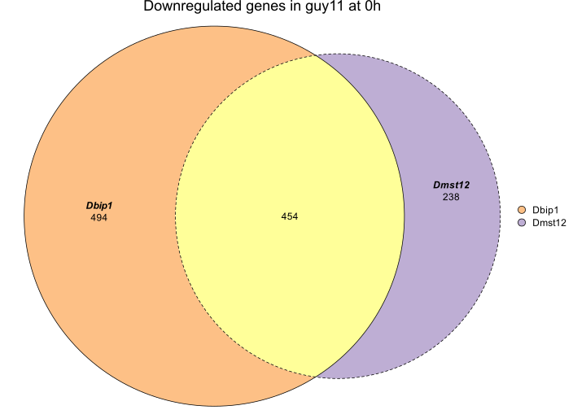
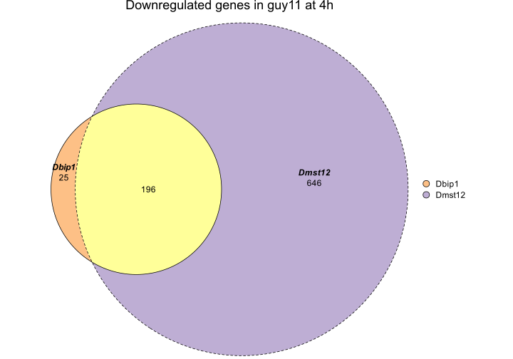
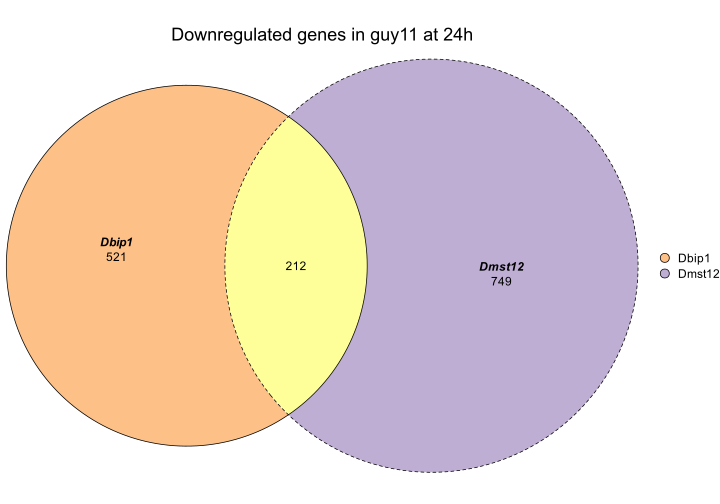
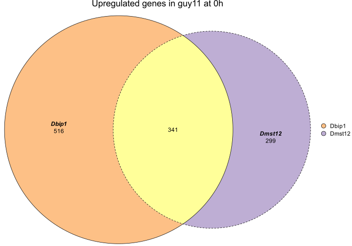
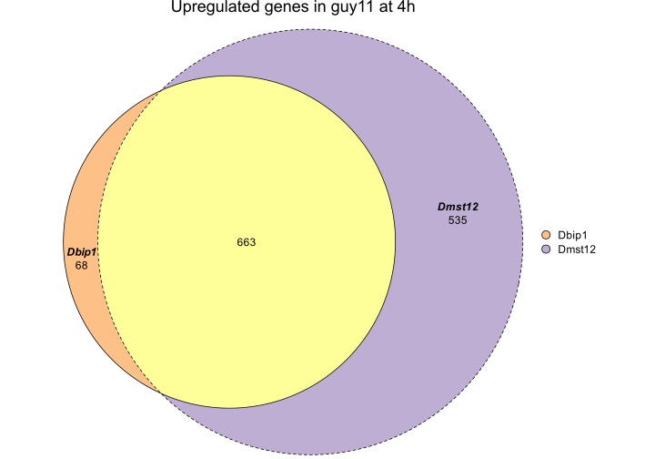
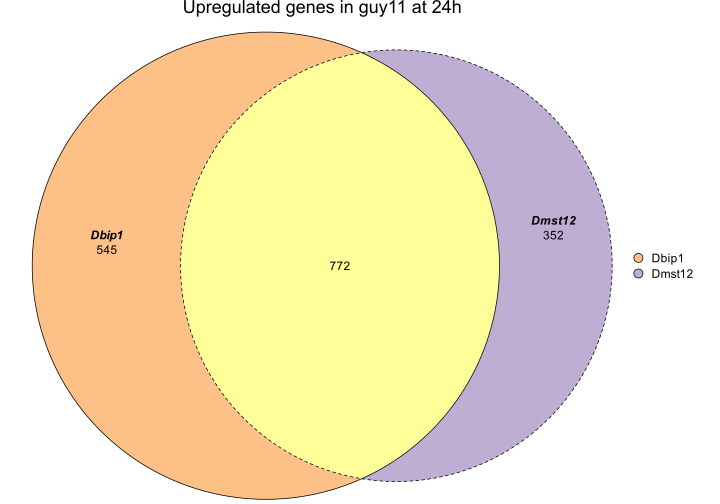
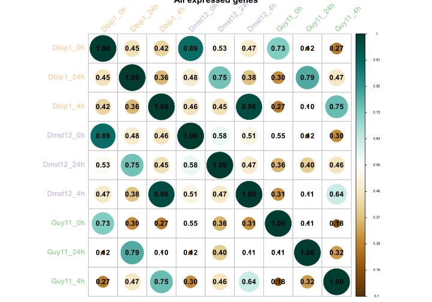
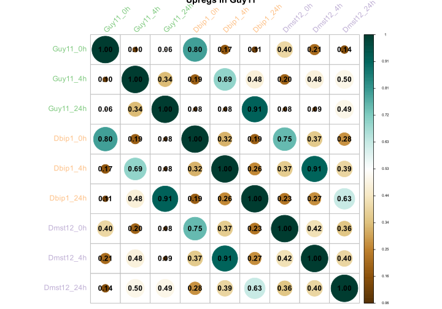
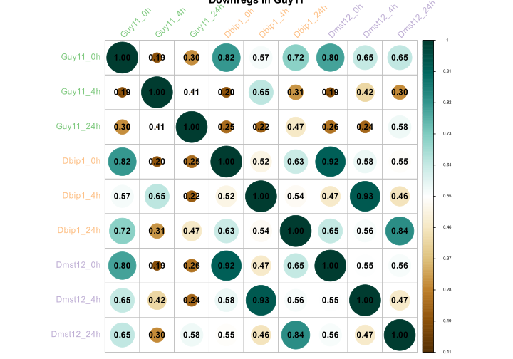

Check if DEGs in Dbip1 and Dmst12 are co-regulated or co expressed
================
Neha Sahu
23 April, 2026

- [Description](#description)
  - [Objectives:](#objectives)
  - [Load Libraries](#load-libraries)
- [**Eulerr plots**](#eulerr-plots)
  - [Merged DEGs File](#merged-degs-file)
  - [Downregulated in Guy11 - Upregulated in Dbip1,
    Dmst12](#downregulated-in-guy11---upregulated-in-dbip1-dmst12)
  - [Upregulated in Guy11 - Downregulated in Dbip1,
    Dmst12](#upregulated-in-guy11---downregulated-in-dbip1-dmst12)
- [**Correlation Between Samples**](#correlation-between-samples)
  - [Load TPM table](#load-tpm-table)
  - [Calculate and Plot Pearson Correlation Between Samples - For All
    Genes](#calculate-and-plot-pearson-correlation-between-samples---for-all-genes)
  - [Calculate and Plot Pearson Correlation Between Samples - For Genes
    Upregulated in
    Guy11](#calculate-and-plot-pearson-correlation-between-samples---for-genes-upregulated-in-guy11)
  - [Calculate and Plot Pearson Correlation Between Samples - For Genes
    Downregulated in
    Guy11](#calculate-and-plot-pearson-correlation-between-samples---for-genes-downregulated-in-guy11)
- [**Heatmaps**](#heatmaps)
  - [Load DEGs in Dmst12 and Dbip1 for
    Heatmap](#load-degs-in-dmst12-and-dbip1-for-heatmap)
  - [Upregs in Guy11](#upregs-in-guy11)
  - [Downregs in Guy11](#downregs-in-guy11)

# Description

This analysis continues from 002_rna_seq.Rmd and checks the
co-expression patterns between mst12 and bip1 genes in *Magnaporthe
oryzae*. The goal is to see if bip1 and mst12 are co-regulated by
checking their expression patterns across different mutant strains
(Dbip1, Dmst12) and timepoints (0h, 4h, and 24h). In simple terms, I
want to see if mst12 and bip1 show coordinated/similar regulation
patterns.

## Objectives:

1.  Create Euler diagrams to visualize overlap of differentially
    expressed genes between mutant strains

2.  Generate correlation matrices to assess co-expression patterns

3.  Make heatmaps to visualize expression profiles of differently
    expressed genes

## Load Libraries

``` r
library(tidyverse)
library(eulerr) # for eulerr plot
library(corrplot) # for correlation plot
library(gplots) # for heatmap
```

# **Eulerr plots**

### Merged DEGs File

``` r
merged_data <- read_csv(here("data/results/002_rna_seq/merged_DEGs_guy11_vs_Dbip1_Dmst12.csv"))

degs_filt <- merged_data %>%
  select(target_id,Comparison,DEG_status) %>%
  filter(DEG_status!="not_DEG") %>%
  mutate(time=word(Comparison,sep="_",4,4),
         sample=word(Comparison,sep="_",3,3),
         DEG_status=gsub("_in_guy11","",DEG_status)) %>%
  select(-Comparison) %>%
  distinct()
unique(degs_filt$time)
```

    ## [1] "0h"  "24h" "4h"

### Downregulated in Guy11 - Upregulated in Dbip1, Dmst12

``` r
# Function to create Euler plots for each timepoint
create_euler_plot <- function(time_point, deg_status, title_suffix) {
  downreg <- degs_filt %>%
    filter(DEG_status == deg_status, time == time_point) %>%
    distinct() %>%
    select(-DEG_status, -time) %>%
    arrange(target_id, factor(sample, levels = c("Dbip1", "Dmst12"))) %>%
    aggregate(. ~ target_id, toString)
  
  downreg_set <- data.frame(table(downreg$sample))
  downreg_set$Var1 <- gsub(", ", "&", downreg_set$Var1)
  downreg_data <- setNames(downreg_set$Freq, downreg_set$Var1)
  
  euler_plot <- euler(downreg_data, shape = "ellipse", input = c("disjoint"), loss = c("abs"))
  
  # Save data
  save_data(downreg_set, paste0("euler_", gsub(" ", "_", tolower(title_suffix)), "_", time_point))
 
  return(list(data = downreg_set, euler_obj = euler_plot))
}

# Create plots for downregulated genes at each timepoint
downreg_0h <- create_euler_plot("0h", "downreg", "Downregulated genes in guy11")
downreg_4h <- create_euler_plot("4h", "downreg", "Downregulated genes in guy11")
downreg_24h <- create_euler_plot("24h", "downreg", "Downregulated genes in guy11")

plot(downreg_0h$euler_obj,fills = list(fill = c("#fdc086", "#beaed4", "#ffff99")),
     legend = TRUE,
     quantities = TRUE,
     labels = list(font = 4, cex = 1),
     lty = 1:4,
     main = "Downregulated genes in guy11 at 0h")
```



``` r
plot(downreg_4h$euler_obj,fills = list(fill = c("#fdc086", "#beaed4", "#ffff99")),
     legend = TRUE,
     quantities = TRUE,
     labels = list(font = 4, cex = 1),
     lty = 1:4,
     main = "Downregulated genes in guy11 at 4h")
```



``` r
plot(downreg_24h$euler_obj,fills = list(fill = c("#fdc086", "#beaed4", "#ffff99")),
     legend = TRUE,
     quantities = TRUE,
     labels = list(font = 4, cex = 1),
     lty = 1:4,
     main = "Downregulated genes in guy11 at 24h")
```



### Upregulated in Guy11 - Downregulated in Dbip1, Dmst12

``` r
# Function to create Euler plots for each timepoint
create_euler_plot <- function(time_point, deg_status, title_suffix) {
  upreg <- degs_filt %>%
    filter(DEG_status == deg_status, time == time_point) %>%
    distinct() %>%
    select(-DEG_status, -time) %>%
    arrange(target_id, factor(sample, levels = c("Dbip1", "Dmst12"))) %>%
    aggregate(. ~ target_id, toString)
  
  upreg_set <- data.frame(table(upreg$sample))
  upreg_set$Var1 <- gsub(", ", "&", upreg_set$Var1)
  upreg_data <- setNames(upreg_set$Freq, upreg_set$Var1)
  
  euler_plot <- euler(upreg_data, shape = "ellipse", input = c("disjoint"), loss = c("abs"))
  
  # Save data and plot
  save_data(upreg_set, paste0("euler_", gsub(" ", "_", tolower(title_suffix)), "_", time_point))
  
  return(list(data = upreg_set, euler_obj = euler_plot))
}

# Create plots for upregulated genes at each timepoint
upreg_0h <- create_euler_plot("0h", "upreg", "upregulated genes in guy11")
upreg_4h <- create_euler_plot("4h", "upreg", "upregulated genes in guy11")
upreg_24h <- create_euler_plot("24h", "upreg", "upregulated genes in guy11")

plot(upreg_0h$euler_obj,fills = list(fill = c("#fdc086", "#beaed4", "#ffff99")),
     legend = TRUE,
     quantities = TRUE,
     labels = list(font = 4, cex = 1),
     lty = 1:4,
     main = "Upregulated genes in guy11 at 0h")
```



``` r
plot(upreg_4h$euler_obj,fills = list(fill = c("#fdc086", "#beaed4", "#ffff99")),
     legend = TRUE,
     quantities = TRUE,
     labels = list(font = 4, cex = 1),
     lty = 1:4,
     main = "Upregulated genes in guy11 at 4h")
```



``` r
plot(upreg_24h$euler_obj,fills = list(fill = c("#fdc086", "#beaed4", "#ffff99")),
     legend = TRUE,
     quantities = TRUE,
     labels = list(font = 4, cex = 1),
     lty = 1:4,
     main = "Upregulated genes in guy11 at 24h")
```



# **Correlation Between Samples**

### Load TPM table

``` r
tpm <- read_csv(here("data/results/002_rna_seq/TPM_table.csv"))
colnames(tpm)
```

    ##  [1] "target_id"  "Dbip1_0h"   "Dbip1_24h"  "Dbip1_4h"   "Dmst12_0h" 
    ##  [6] "Dmst12_24h" "Dmst12_4h"  "Guy11_0h"   "Guy11_24h"  "Guy11_4h"

``` r
tpm_corr<-data.matrix(tpm[,-1])
head(tpm_corr[1,])
```

    ##   Dbip1_0h  Dbip1_24h   Dbip1_4h  Dmst12_0h Dmst12_24h  Dmst12_4h 
    ##   1.666667   4.303033   4.666667   3.833333   4.230340  11.333333

### Calculate and Plot Pearson Correlation Between Samples - For All Genes

``` r
M<-cor(tpm_corr, method="pearson",use="pairwise.complete.obs")
head(M[1,])
```

    ##   Dbip1_0h  Dbip1_24h   Dbip1_4h  Dmst12_0h Dmst12_24h  Dmst12_4h 
    ##  1.0000000  0.4494909  0.4199784  0.8933846  0.5339323  0.4710853

``` r
corrplot(M,type="full",method="circle",
         cl.cex=0.5,
         main="All expressed genes", is.corr=F,col = COL2('BrBG'),
         tl.cex = 1,tl.srt = 45,addCoef.col = 'black',
         diag=T,
         tl.col = c(rep("#fdc086",3),#bip1
                    rep("#beaed4",3),#mst12
                    rep("#7fc97f",3))) #guy11
```



### Calculate and Plot Pearson Correlation Between Samples - For Genes Upregulated in Guy11

``` r
degs_pcorr <- merged_data %>%
  select(target_id,Comparison,DEG_status) %>%
  filter(DEG_status=="upreg_in_guy11") %>%
  mutate(time=word(Comparison,sep="_",4,4),
         sample=word(Comparison,sep="_",3,3)) %>%
  select(-Comparison) %>%
  filter(sample!="tbip1") %>%
  select(target_id) %>%
  distinct()
head(degs_pcorr)
```

    ## # A tibble: 6 × 1
    ##   target_id  
    ##   <chr>      
    ## 1 MGG_15302T0
    ## 2 MGG_03604T0
    ## 3 MGG_08180T0
    ## 4 MGG_08802T0
    ## 5 MGG_08035T0
    ## 6 MGG_01293T0

``` r
tpm_degs <- tpm %>%
  filter(target_id %in% degs_pcorr$target_id) %>%
  select(target_id,
         Guy11_0h,Guy11_4h,Guy11_24h,
         Dbip1_0h,Dbip1_4h,Dbip1_24h,
         Dmst12_0h,Dmst12_4h,Dmst12_24h)
tpm_degs_corr<-data.matrix(tpm_degs[,-1])
head(tpm_degs_corr[1,])
```

    ##  Guy11_0h  Guy11_4h Guy11_24h  Dbip1_0h  Dbip1_4h Dbip1_24h 
    ## 6.1666667 0.3333333 1.0459767 0.3333333 2.8333333 3.8772033

``` r
M_degs<-cor(tpm_degs_corr, method="pearson",use="pairwise.complete.obs")
head(M_degs[1,])
```

    ##   Guy11_0h   Guy11_4h  Guy11_24h   Dbip1_0h   Dbip1_4h  Dbip1_24h 
    ## 1.00000000 0.09787613 0.06421036 0.79539102 0.17010746 0.10773470

``` r
corrplot(M_degs,type="full",method="circle",
         cl.cex=0.5,
         main="Upregs in Guy11", is.corr=F,col = COL2('BrBG'),
         tl.cex = 1,tl.srt = 45,addCoef.col = 'black',
         diag=T,
         tl.col = c(rep("#7fc97f",3),#guy11
                    rep("#fdc086",3),#bip1
                    rep("#beaed4",3)#mst12
                    )) 
```



### Calculate and Plot Pearson Correlation Between Samples - For Genes Downregulated in Guy11

``` r
degs_pcorr <- merged_data %>%
  select(target_id,Comparison,DEG_status) %>%
  filter(DEG_status=="downreg_in_guy11") %>%
  mutate(time=word(Comparison,sep="_",4,4),
         sample=word(Comparison,sep="_",3,3)) %>%
  select(-Comparison) %>%
  filter(sample!="tbip1") %>%
  select(target_id) %>%
  distinct()
head(degs_pcorr)
```

    ## # A tibble: 6 × 1
    ##   target_id  
    ##   <chr>      
    ## 1 MGG_07030T0
    ## 2 MGG_01217T0
    ## 3 MGG_07075T0
    ## 4 MGG_04641T0
    ## 5 MGG_00842T0
    ## 6 MGG_03129T0

``` r
tpm_degs <- tpm %>%
  filter(target_id %in% degs_pcorr$target_id) %>%
  select(target_id,
         Guy11_0h,Guy11_4h,Guy11_24h,
         Dbip1_0h,Dbip1_4h,Dbip1_24h,
         Dmst12_0h,Dmst12_4h,Dmst12_24h)
tpm_degs_corr<-data.matrix(tpm_degs[,-1])
head(tpm_degs_corr[1,])
```

    ##  Guy11_0h  Guy11_4h Guy11_24h  Dbip1_0h  Dbip1_4h Dbip1_24h 
    ## 4.7333333 0.3333333 3.3333333 1.6666667 4.6666667 4.3030333

``` r
M_degs<-cor(tpm_degs_corr, method="pearson",use="pairwise.complete.obs")
head(M_degs[1,])
```

    ##  Guy11_0h  Guy11_4h Guy11_24h  Dbip1_0h  Dbip1_4h Dbip1_24h 
    ## 1.0000000 0.1943222 0.3045248 0.8169713 0.5699255 0.7181640

``` r
corrplot(M_degs,type="full",method="circle",
         cl.cex=0.5,
         main="Downregs in Guy11", is.corr=F,col = COL2('BrBG'),
         tl.cex = 1,tl.srt = 45,addCoef.col = 'black',
         diag=T,
         tl.col = c(rep("#7fc97f",3),#guy11
                    rep("#fdc086",3),#bip1
                    rep("#beaed4",3)#mst12
                    )) 
```



# **Heatmaps**

### Load DEGs in Dmst12 and Dbip1 for Heatmap

``` r
degs_heat <- merged_data %>%
  select(target_id,Comparison,DEG_status) %>%
  filter(DEG_status!="Not_DEG") %>%
  mutate(time=word(Comparison,sep="_",4,4),
         sample=word(Comparison,sep="_",3,3)) %>%
  select(-Comparison) %>%
  filter(sample!="tbip1") %>%
  mutate(DEG_status=gsub("_in_guy11","",DEG_status)) %>%
  left_join(tpm,by="target_id") %>%
  distinct()
head(degs_heat)
```

    ## # A tibble: 6 × 13
    ##   target_id   DEG_status time  sample Dbip1_0h Dbip1_24h Dbip1_4h Dmst12_0h
    ##   <chr>       <chr>      <chr> <chr>     <dbl>     <dbl>    <dbl>     <dbl>
    ## 1 MGG_07030T0 downreg    0h    Dbip1     2526.     1058.     393      1951 
    ## 2 MGG_01217T0 downreg    0h    Dbip1     4519.     1414.     782      3431.
    ## 3 MGG_07075T0 downreg    0h    Dbip1     8774      2083.    3485.     4995.
    ## 4 MGG_04641T0 downreg    0h    Dbip1     2068.      639.     375.     1480.
    ## 5 MGG_00842T0 downreg    0h    Dbip1     1337.      642      211      1279.
    ## 6 MGG_03129T0 downreg    0h    Dbip1     1729.      780.     352      1208.
    ## # ℹ 5 more variables: Dmst12_24h <dbl>, Dmst12_4h <dbl>, Guy11_0h <dbl>,
    ## #   Guy11_24h <dbl>, Guy11_4h <dbl>

### Upregs in Guy11

``` r
upreg<-degs_heat %>%
  filter(DEG_status=="upreg") %>%
  select(-DEG_status,-time,-sample) %>%
  distinct() %>%
  column_to_rownames(var="target_id") %>%
  select(Guy11_0h, Guy11_4h, Guy11_24h,
         Dbip1_0h,Dbip1_4h,Dbip1_24h,
         Dmst12_0h,Dmst12_4h,Dmst12_24h)

upreg_matrix<-data.matrix(upreg)

# Use hierarchical clustering
mycols = colorRampPalette(c("blue","white","red"))(100) 
hr <- hclust(as.dist(1-cor(t(upreg_matrix), method="pearson")), method="average") 
dend <- as.dendrogram(hr) # Convert to dendrogram
row_order <- order.dendrogram(dend) # Row order from the hierarchical clustering
upreg_matrix_ordered <- upreg_matrix[row_order, ] %>%  # Reorder matrix based on the clustering
  as.data.frame() %>%
  rownames_to_column(var = "target_id")  # Add row names as a column

# Save ordered matrix
save_data(upreg_matrix_ordered, "upreg_matrix_ordered", format = "txt")

pdf_path <- here::here("data/results/00_figures/003_co_expression", "upregs_guy11vsDbip1_Dmst12.pdf")
#pdf(pdf_path, width = 12, height = 20)
heatmap.2(upreg_matrix, 
                  Rowv = as.dendrogram(hr), 
                  dendrogram = "row", 
                  trace = "none",  
                  col = mycols, 
                  keysize = 1, 
                  key.title = "Title", 
                  Colv = FALSE,
                  scale = c("row"), 
                  cexRow = 0.5, 
                  cexCol = 1, 
                  srtCol = NULL,  
                  srtRow = NULL, 
                  adjRow = c(0,NA), 
                  sepcolor = "white", 
                  margins = c(7,15), 
                  lwid = c(2,8),
                  lhei = c(2,8), 
                  main = "upregs", 
                  na.color = "black")
```


### Downregs in Guy11

``` r
downreg<-degs_heat %>%
  filter(DEG_status=="downreg", sample!="tbip1") %>%
  select(-DEG_status,-time,-sample) %>%
  distinct() %>%
  column_to_rownames(var="target_id") %>%
  select(Guy11_0h, Guy11_4h, Guy11_24h,
         Dbip1_0h,Dbip1_4h,Dbip1_24h,
         Dmst12_0h,Dmst12_4h,Dmst12_24h)

downreg_matrix<-data.matrix(downreg)

# Use hierarchical clustering
mycols = colorRampPalette(c("blue","white","red"))(100) 
hr <- hclust(as.dist(1-cor(t(downreg_matrix), method="pearson")), method="average") 
dend <- as.dendrogram(hr) # Convert to dendrogram
row_order <- order.dendrogram(dend) # Row order from the hierarchical clustering
downreg_matrix_ordered <- downreg_matrix[row_order, ] %>%  # Reorder matrix based on the clustering
  as.data.frame() %>%
  rownames_to_column(var = "target_id")  # Add row names as a column

# Save ordered matrix
save_data(downreg_matrix_ordered, "downreg_matrix_ordered", format = "txt")

pdf_path <- here::here("data/results/00_figures/003_co_expression", "downregs_guy11vsDbip1_Dmst12.pdf")
#pdf(pdf_path, width = 12, height = 20)
heatmap.2(downreg_matrix, 
                  Rowv = as.dendrogram(hr), 
                  dendrogram = "row", 
                  trace = "none",  
                  col = mycols, 
                  keysize = 1, 
                  key.title = "Title", 
                  Colv = FALSE,
                  scale = c("row"), 
                  cexRow = 0.5, 
                  cexCol = 1, 
                  srtCol = NULL,  
                  srtRow = NULL, 
                  adjRow = c(0,NA), 
                  sepcolor = "white", 
                  margins = c(7,15), 
                  lwid = c(2,8),
                  lhei = c(2,8), 
                  main = "downregs", 
                  na.color = "black")
```


``` r
sessionInfo()
```

    ## R version 4.3.1 (2023-06-16)
    ## Platform: aarch64-apple-darwin20 (64-bit)
    ## Running under: macOS 15.7.5
    ## 
    ## Matrix products: default
    ## BLAS:   /Library/Frameworks/R.framework/Versions/4.3-arm64/Resources/lib/libRblas.0.dylib 
    ## LAPACK: /Library/Frameworks/R.framework/Versions/4.3-arm64/Resources/lib/libRlapack.dylib;  LAPACK version 3.11.0
    ## 
    ## locale:
    ## [1] en_US.UTF-8/en_US.UTF-8/en_US.UTF-8/C/en_US.UTF-8/en_US.UTF-8
    ## 
    ## time zone: Europe/London
    ## tzcode source: internal
    ## 
    ## attached base packages:
    ## [1] stats     graphics  grDevices utils     datasets  methods   base     
    ## 
    ## other attached packages:
    ##  [1] gplots_3.2.0    corrplot_0.95   eulerr_7.0.2    lubridate_1.9.4
    ##  [5] forcats_1.0.1   stringr_1.6.0   dplyr_1.1.4     purrr_1.0.4    
    ##  [9] readr_2.1.5     tidyr_1.3.1     tibble_3.3.0    ggplot2_3.5.2  
    ## [13] tidyverse_2.0.0 here_1.0.2     
    ## 
    ## loaded via a namespace (and not attached):
    ##  [1] utf8_1.2.6         generics_0.1.4     bitops_1.0-9       polylabelr_0.3.0  
    ##  [5] KernSmooth_2.23-26 gtools_3.9.5       stringi_1.8.7      hms_1.1.4         
    ##  [9] digest_0.6.37      magrittr_2.0.3     caTools_1.18.3     evaluate_1.0.5    
    ## [13] grid_4.3.1         timechange_0.3.0   RColorBrewer_1.1-3 fastmap_1.2.0     
    ## [17] rprojroot_2.1.1    scales_1.4.0       cli_3.6.5          crayon_1.5.3      
    ## [21] rlang_1.1.6        polyclip_1.10-7    bit64_4.6.0-1      withr_3.0.2       
    ## [25] yaml_2.3.10        parallel_4.3.1     tools_4.3.1        tzdb_0.5.0        
    ## [29] vctrs_0.6.5        R6_2.6.1           lifecycle_1.0.4    bit_4.6.0         
    ## [33] vroom_1.6.5        archive_1.1.12     pkgconfig_2.0.3    pillar_1.11.1     
    ## [37] gtable_0.3.6       glue_1.8.0         Rcpp_1.1.0         xfun_0.52         
    ## [41] tidyselect_1.2.1   rstudioapi_0.17.1  knitr_1.50         dichromat_2.0-0.1 
    ## [45] farver_2.1.2       htmltools_0.5.8.1  rmarkdown_2.29     compiler_4.3.1
