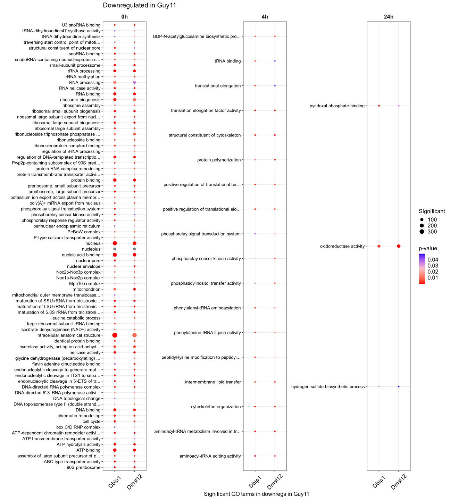
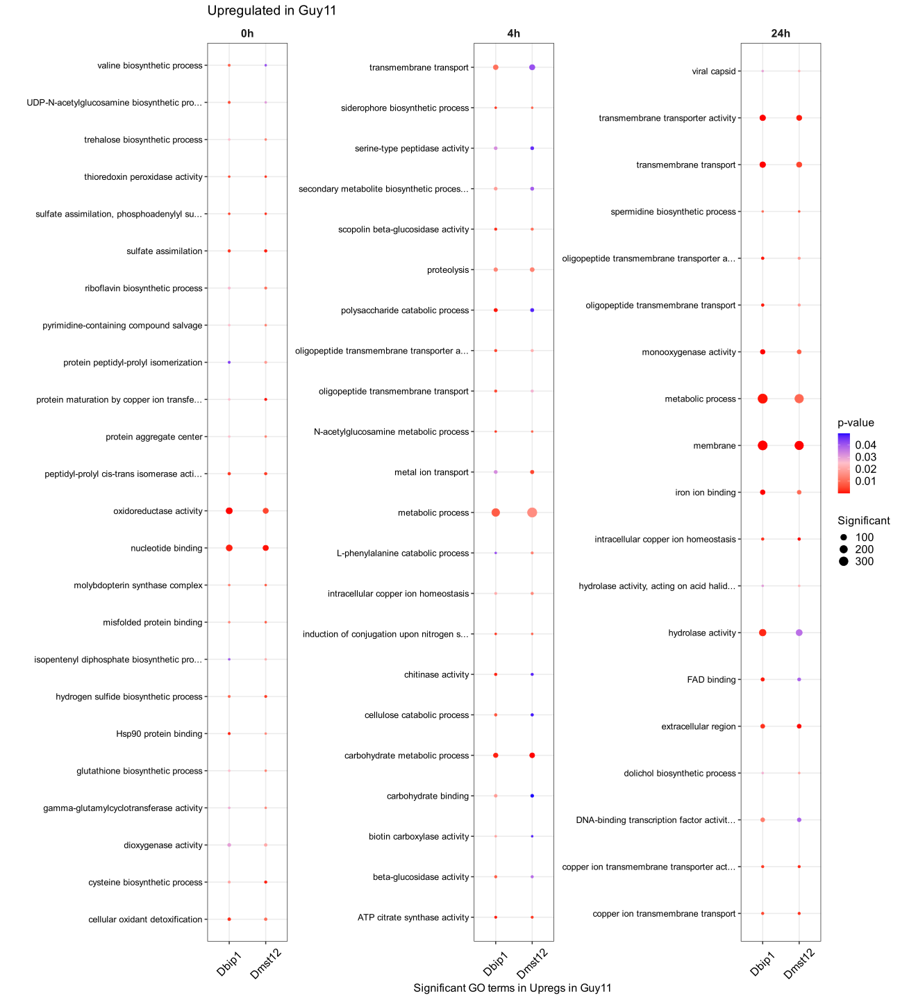
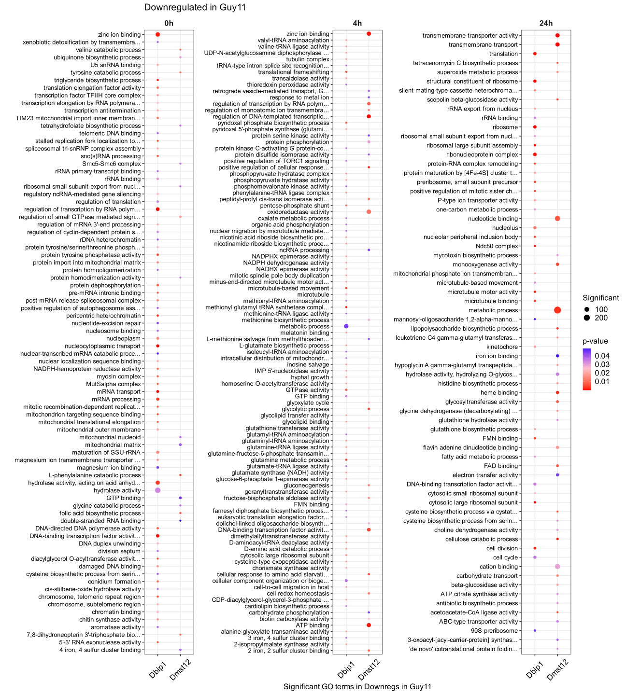
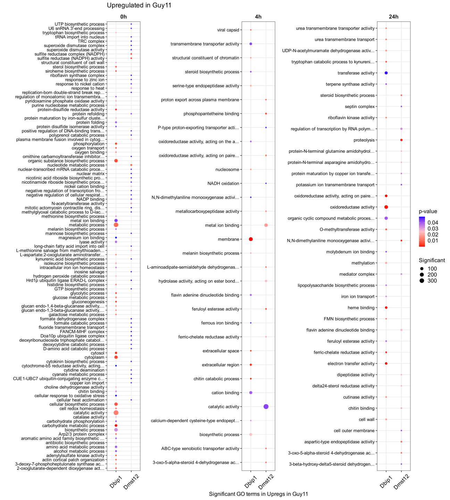

GO Enrichment Analysis of DEGs in Dbip1 and Dmst12 Mutants
================
Neha Sahu
23 April, 2026

- [**Introduction**](#introduction)
  - [Objectives:](#objectives)
  - [Load Libraries](#load-libraries)
- [**Data Preparation**](#data-preparation)
  - [Merged DEGs File](#merged-degs-file)
  - [GOs Gene Universe File](#gos-gene-universe-file)
  - [GO Enrichment - Biological
    Process](#go-enrichment---biological-process)
  - [GO Enrichment - Molecular
    Function](#go-enrichment---molecular-function)
  - [GO Enrichment - Cellular
    Component](#go-enrichment---cellular-component)
- [**Visualization of GO enrichment**](#visualization-of-go-enrichment)
  - [Merge GO Enrichment Results](#merge-go-enrichment-results)
  - [File for Plotting only Dbip1 and
    Dmst12](#file-for-plotting-only-dbip1-and-dmst12)
  - [Plot - Downregulated in Guy11 - Common in Dbip1 and
    Dmst12](#plot---downregulated-in-guy11---common-in-dbip1-and-dmst12)
  - [Plot - Upregulated in Guy11 - Common in Dbip1 and
    Dmst12](#plot---upregulated-in-guy11---common-in-dbip1-and-dmst12)
  - [Plot - Downregulated in Guy11 - Specific in Dbip1 and
    Dmst12](#plot---downregulated-in-guy11---specific-in-dbip1-and-dmst12)
  - [Plot - Upregulated in Guy11 - Specific in Dbip1 and
    Dmst12](#plot---upregulated-in-guy11---specific-in-dbip1-and-dmst12)

# **Introduction**

This analysis continues from 002_rna_seq.html and
003_co_expression.html.

This analysis performs Gene Ontology (GO) enrichment analysis on
differentially expressed genes (DEGs) identified in the RNA-seq
comparison between Guy11 wild-type and mutant strains (Dbip1, Dmst12)
across different timepoints (0h, 4h, and 24h). The goal is to identify
biological processes, molecular functions, and cellular components that
are significantly enriched in upregulated and downregulated gene sets
and figgify them.

## Objectives:

- Perform GO enrichment analysis for Biological Process (BP), Molecular
  Function (MF), and Cellular Component (CC) ontologies
- Compare enriched terms between different mutant strains and timepoints
- Visualize enrichment result
- Generate summary tables of significantly enriched GO terms

## Load Libraries

``` r
library(tidyverse)
library(topGO) # for go enrichment
```

# **Data Preparation**

### Merged DEGs File

``` r
merged_data <- read_csv(here("data/results/002_rna_seq/merged_DEGs_guy11_vs_Dbip1_Dmst12.csv"))

degs_filt <- merged_data %>%
  dplyr::select(target_id,Comparison,DEG_status) %>%
  filter(DEG_status!="Not_DEG") %>%
  mutate(time=word(Comparison,sep="_",4,4),
         sample=word(Comparison,sep="_",3,3),
         target_id=sub("T[0-9]$", "", target_id),
         DEG_status=sub("_in_guy11","",DEG_status),
         category=paste0(DEG_status,"_",sample,"_",time)) %>%
  dplyr::select(target_id,category) %>%
  distinct()
```

### GOs Gene Universe File

``` r
go_univ <- read_tsv(here("data/raw/000_published_and_db_sources/", "MG8_biomart.txt")) %>%
  dplyr::select("Gene stable ID", "GO term accession") %>%
  distinct() %>%
  na.omit() %>%
  setNames(c("ProtID", "GO_ID")) %>%
  group_by(ProtID) %>%
  summarise(GO_ID = toString(GO_ID), .groups = 'drop') %>%
  write.table(here("data/processed/go_univ.tsv"),sep="\t",row.names = F, quote=F)

geneID2GO <- readMappings(file=here("data/processed/go_univ.tsv")) ##gene_universe file contains two columns, one is for target_ids and other is for comma separated GO terms belonging to that target_id
head(geneID2GO)
geneUniverse <- names(geneID2GO)
```

### GO Enrichment - Biological Process

``` r
# Extract unique category names
unique_classes <- unique(degs_filt$category)

# Loop through each unique class and perform the analysis
for (class_name in unique_classes) {
  # Subset data for the current class
  class_data <- degs_filt[degs_filt$category == class_name, "target_id"]
  
  # Create a named vector
  geneList <- factor(as.integer(geneUniverse %in% class_data$target_id))
  names(geneList) <- geneUniverse
  
  # Perform your topGO analysis here
  myGOdata <- new("topGOdata", description="My project", ontology="BP", allGenes=geneList,  annot = annFUN.gene2GO, gene2GO = geneID2GO)
  sg <- sigGenes(myGOdata)
  str(sg)
  numSigGenes(myGOdata)
  resultTopgo <- runTest(myGOdata, algorithm="weight01", statistic="fisher")
  mysummary <- summary(attributes(resultTopgo)$score <= 0.05)
  mysummary
  numsignif <- as.integer(mysummary[[3]])
  sigRes <- GenTable(myGOdata, topgoFisher = resultTopgo, orderBy = "topgoFisher", ranksOf = "classicFisher", topNodes = numsignif)
  sigRes
    # create the file name
  save_data(sigRes, paste0("sigBP_", class_name), format = "tsv")
}
```

### GO Enrichment - Molecular Function

``` r
# Extract unique category names
unique_classes <- unique(degs_filt$category)

# Loop through each unique class and perform the analysis
for (class_name in unique_classes) {
  # Subset data for the current class
  class_data <- degs_filt[degs_filt$category == class_name, "target_id"]
  
  # Create a named vector
  geneList <- factor(as.integer(geneUniverse %in% class_data$target_id))
  names(geneList) <- geneUniverse
  
  # Perform your topGO analysis here
  myGOdata <- new("topGOdata", description="My project", ontology="MF", allGenes=geneList,  annot = annFUN.gene2GO, gene2GO = geneID2GO)
  sg <- sigGenes(myGOdata)
  str(sg)
  numSigGenes(myGOdata)
  resultTopgo <- runTest(myGOdata, algorithm="weight01", statistic="fisher")
  mysummary <- summary(attributes(resultTopgo)$score <= 0.05)
  mysummary
  numsignif <- as.integer(mysummary[[3]])
  sigRes <- GenTable(myGOdata, topgoFisher = resultTopgo, orderBy = "topgoFisher", ranksOf = "classicFisher", topNodes = numsignif)
  sigRes
    # create the file name
  save_data(sigRes, paste0("sigMF_", class_name), format = "tsv")
}
```

### GO Enrichment - Cellular Component

``` r
# Extract unique category names
unique_classes <- unique(degs_filt$category)

# Loop through each unique class and perform the analysis
for (class_name in unique_classes) {
  # Subset data for the current class
  class_data <- degs_filt[degs_filt$category == class_name, "target_id"]
  
  # Create a named vector
  geneList <- factor(as.integer(geneUniverse %in% class_data$target_id))
  names(geneList) <- geneUniverse
  
  # Perform your topGO analysis here
  myGOdata <- new("topGOdata", description="My project", ontology="CC", allGenes=geneList,  annot = annFUN.gene2GO, gene2GO = geneID2GO)
  sg <- sigGenes(myGOdata)
  str(sg)
  numSigGenes(myGOdata)
  resultTopgo <- runTest(myGOdata, algorithm="weight01", statistic="fisher")
  mysummary <- summary(attributes(resultTopgo)$score <= 0.05)
  mysummary
  numsignif <- as.integer(mysummary[[3]])
  sigRes <- GenTable(myGOdata, topgoFisher = resultTopgo, orderBy = "topgoFisher", ranksOf = "classicFisher", topNodes = numsignif)
  sigRes
    # create the file name
  save_data(sigRes, paste0("sigCC_", class_name), format = "tsv")
}
```

# **Visualization of GO enrichment**

### Merge GO Enrichment Results

``` r
file_names <- list.files(path = here("data/results/004_go_enrichment/"), pattern = "sig")
file_names
```

    ##  [1] "sigBP_downreg_Dbip1_0h.tsv"   "sigBP_downreg_Dbip1_24h.tsv" 
    ##  [3] "sigBP_downreg_Dbip1_4h.tsv"   "sigBP_downreg_Dmst12_0h.tsv" 
    ##  [5] "sigBP_downreg_Dmst12_24h.tsv" "sigBP_downreg_Dmst12_4h.tsv" 
    ##  [7] "sigBP_upreg_Dbip1_0h.tsv"     "sigBP_upreg_Dbip1_24h.tsv"   
    ##  [9] "sigBP_upreg_Dbip1_4h.tsv"     "sigBP_upreg_Dmst12_0h.tsv"   
    ## [11] "sigBP_upreg_Dmst12_24h.tsv"   "sigBP_upreg_Dmst12_4h.tsv"   
    ## [13] "sigCC_downreg_Dbip1_0h.tsv"   "sigCC_downreg_Dbip1_24h.tsv" 
    ## [15] "sigCC_downreg_Dbip1_4h.tsv"   "sigCC_downreg_Dmst12_0h.tsv" 
    ## [17] "sigCC_upreg_Dbip1_0h.tsv"     "sigCC_upreg_Dbip1_24h.tsv"   
    ## [19] "sigCC_upreg_Dbip1_4h.tsv"     "sigCC_upreg_Dmst12_0h.tsv"   
    ## [21] "sigCC_upreg_Dmst12_24h.tsv"   "sigMF_downreg_Dbip1_0h.tsv"  
    ## [23] "sigMF_downreg_Dbip1_24h.tsv"  "sigMF_downreg_Dbip1_4h.tsv"  
    ## [25] "sigMF_downreg_Dmst12_0h.tsv"  "sigMF_downreg_Dmst12_24h.tsv"
    ## [27] "sigMF_downreg_Dmst12_4h.tsv"  "sigMF_upreg_Dbip1_0h.tsv"    
    ## [29] "sigMF_upreg_Dbip1_24h.tsv"    "sigMF_upreg_Dbip1_4h.tsv"    
    ## [31] "sigMF_upreg_Dmst12_0h.tsv"    "sigMF_upreg_Dmst12_24h.tsv"  
    ## [33] "sigMF_upreg_Dmst12_4h.tsv"

``` r
sig_data <- map_dfr(file_names, ~ {
  data <- read_tsv(here("data/results/004_go_enrichment/", .x))
  data$topgoFisher <- as.character(data$topgoFisher)
  data$filename <- basename(.x)
  return(data)
}) %>%
   mutate(
  GO_cat = gsub("sig", "", word(filename, 1, 1, sep = "_")),
  filename = gsub(".tsv", "", word(filename, 2, 4, sep = "_")))
save_data(sig_data, "go_enrichment_results",format = "tsv")
unique(sig_data$GO_cat)
```

    ## [1] "BP" "CC" "MF"

### File for Plotting only Dbip1 and Dmst12

``` r
order <- c("0h","4h","24h")
sig_data_fin<- sig_data %>%
  mutate(sample=word(filename,sep="_",2,2),
         time=word(filename,sep="_",3,3),
         reg=word(filename,sep="_",1,1)) %>%
  filter(sample!="tbip1") %>%
  group_by(GO.ID,reg,time) %>%
  mutate(facet_label = ifelse(n_distinct(filename) == 1, "Specific", "Common"),
         tot_count = as.numeric(n())) %>%
  ungroup() %>%
  mutate(topgoFisher=as.numeric(topgoFisher))

sig_data_fin$time <- factor(sig_data_fin$time, levels = order)
sapply(sig_data_fin,class)
```

    ##       GO.ID        Term   Annotated Significant    Expected topgoFisher 
    ## "character" "character"   "numeric"   "numeric"   "numeric"   "numeric" 
    ##    filename      GO_cat      sample        time         reg facet_label 
    ## "character" "character" "character"    "factor" "character" "character" 
    ##   tot_count 
    ##   "numeric"

``` r
head(sig_data_fin)
```

    ## # A tibble: 6 × 13
    ##   GO.ID  Term  Annotated Significant Expected topgoFisher filename GO_cat sample
    ##   <chr>  <chr>     <dbl>       <dbl>    <dbl>       <dbl> <chr>    <chr>  <chr> 
    ## 1 GO:00… rRNA…       138          71    11.8     6.20e-15 downreg… BP     Dbip1 
    ## 2 GO:00… matu…        19          15     1.62    1.9 e-11 downreg… BP     Dbip1 
    ## 3 GO:00… endo…        16          12     1.37    1.80e-10 downreg… BP     Dbip1 
    ## 4 GO:00… endo…        14          11     1.2     4.70e-10 downreg… BP     Dbip1 
    ## 5 GO:00… endo…        13          10     1.11    4.40e- 9 downreg… BP     Dbip1 
    ## 6 GO:00… mRNA…        38          15     3.25    3.8 e- 8 downreg… BP     Dbip1 
    ## # ℹ 4 more variables: time <fct>, reg <chr>, facet_label <chr>, tot_count <dbl>

``` r
unique(sig_data_fin$filename)
```

    ##  [1] "downreg_Dbip1_0h"   "downreg_Dbip1_24h"  "downreg_Dbip1_4h"  
    ##  [4] "downreg_Dmst12_0h"  "downreg_Dmst12_24h" "downreg_Dmst12_4h" 
    ##  [7] "upreg_Dbip1_0h"     "upreg_Dbip1_24h"    "upreg_Dbip1_4h"    
    ## [10] "upreg_Dmst12_0h"    "upreg_Dmst12_24h"   "upreg_Dmst12_4h"

### Plot - Downregulated in Guy11 - Common in Dbip1 and Dmst12

``` r
sig_data_fin %>%
         filter(reg=="downreg",
                facet_label=="Common") %>%
  ggplot(aes(x = sample, 
        y = fct_reorder(Term, -tot_count))) +
  ggtitle("Downregulated in Guy11") +
  geom_point(aes(color = topgoFisher, size=Significant)) +
  facet_wrap(~ time, scales = "free") +
  scale_color_gradient2("p-value", low = "red", mid = "pink", high = "blue", midpoint = 0.025) +
  theme_bw(base_size = 16) +
  xlab("") + ylab("") +
  theme(legend.text = element_text(size = 16), 
       axis.text.y = element_text(color = "black"),
         axis.text.x = element_text(color = "black", size = 16,angle=45,vjust=0.5),
        strip.text = element_text(size = 16, face = "bold"), 
        strip.background = element_blank()) +
  xlab("Significant GO terms in downregs in Guy11")
```



### Plot - Upregulated in Guy11 - Common in Dbip1 and Dmst12

``` r
sig_data_fin %>%
         filter(reg=="upreg",
                facet_label=="Common") %>%
  ggplot(aes(x = sample, 
        y = fct_reorder(Term, -tot_count))) +
  ggtitle("Upregulated in Guy11") +
  geom_point(aes(color = topgoFisher, size=Significant)) +
  facet_wrap(~ time, scales = "free") +
  scale_color_gradient2("p-value", low = "red", mid = "pink", high = "blue", midpoint = 0.025) +
  theme_bw(base_size = 16) +
  xlab("") + ylab("") +
  theme(legend.text = element_text(size = 16), 
       axis.text.y = element_text(color = "black"),
         axis.text.x = element_text(color = "black", size = 16,angle=45,vjust=0.5),
        strip.text = element_text(size = 16, face = "bold"), 
        strip.background = element_blank()) +
  xlab("Significant GO terms in Upregs in Guy11 ") + ylab("")
```



### Plot - Downregulated in Guy11 - Specific in Dbip1 and Dmst12

``` r
sig_data_fin %>%
         filter(reg=="downreg",
                facet_label=="Specific") %>%
  ggplot(aes(x = sample, 
        y = fct_reorder(Term, -tot_count))) +
  ggtitle("Downregulated in Guy11") +
  geom_point(aes(color = topgoFisher, size=Significant)) +
  facet_wrap(~ time, scales = "free") +
  scale_color_gradient2("p-value", low = "red", mid = "pink", high = "blue", midpoint = 0.025) +
    theme_bw(base_size = 16) +
  xlab("") + ylab("") +
  theme(legend.text = element_text(size = 16), 
       axis.text.y = element_text(color = "black"),
         axis.text.x = element_text(color = "black", size = 16,angle=45,vjust=0.5),
        strip.text = element_text(size = 16, face = "bold"), 
        strip.background = element_blank()) +
  xlab("Significant GO terms in Downregs in Guy11")
```



### Plot - Upregulated in Guy11 - Specific in Dbip1 and Dmst12

``` r
sig_data_fin %>%
         filter(reg=="upreg",
                facet_label=="Specific") %>%
  ggplot(aes(x = sample, 
        y = fct_reorder(Term, -tot_count))) +
  ggtitle("Upregulated in Guy11") +
  geom_point(aes(color = topgoFisher, size=Significant)) +
  facet_wrap(~ time, scales = "free") +
  scale_color_gradient2("p-value", low = "red", mid = "pink", high = "blue", midpoint = 0.025) +
    theme_bw(base_size = 16) +
  xlab("") + ylab("") +
  theme(legend.text = element_text(size = 16), 
       axis.text.y = element_text(color = "black"),
         axis.text.x = element_text(color = "black", size = 16,angle=45,vjust=0.5),
        strip.text = element_text(size = 16, face = "bold"), 
        strip.background = element_blank()) +
  xlab("Significant GO terms in Upregs in Guy11") + ylab("")
```



``` r
sessionInfo()
```

    ## R version 4.3.1 (2023-06-16)
    ## Platform: aarch64-apple-darwin20 (64-bit)
    ## Running under: macOS 15.7.5
    ## 
    ## Matrix products: default
    ## BLAS:   /Library/Frameworks/R.framework/Versions/4.3-arm64/Resources/lib/libRblas.0.dylib 
    ## LAPACK: /Library/Frameworks/R.framework/Versions/4.3-arm64/Resources/lib/libRlapack.dylib;  LAPACK version 3.11.0
    ## 
    ## locale:
    ## [1] en_US.UTF-8/en_US.UTF-8/en_US.UTF-8/C/en_US.UTF-8/en_US.UTF-8
    ## 
    ## time zone: Europe/London
    ## tzcode source: internal
    ## 
    ## attached base packages:
    ## [1] stats4    stats     graphics  grDevices utils     datasets  methods  
    ## [8] base     
    ## 
    ## other attached packages:
    ##  [1] topGO_2.54.0         SparseM_1.84-2       GO.db_3.18.0        
    ##  [4] AnnotationDbi_1.64.1 IRanges_2.36.0       S4Vectors_0.40.2    
    ##  [7] Biobase_2.62.0       graph_1.80.0         BiocGenerics_0.48.1 
    ## [10] lubridate_1.9.4      forcats_1.0.1        stringr_1.6.0       
    ## [13] dplyr_1.1.4          purrr_1.0.4          readr_2.1.5         
    ## [16] tidyr_1.3.1          tibble_3.3.0         ggplot2_3.5.2       
    ## [19] tidyverse_2.0.0      here_1.0.2          
    ## 
    ## loaded via a namespace (and not attached):
    ##  [1] KEGGREST_1.42.0         gtable_0.3.6            xfun_0.52              
    ##  [4] lattice_0.22-7          tzdb_0.5.0              vctrs_0.6.5            
    ##  [7] tools_4.3.1             bitops_1.0-9            generics_0.1.4         
    ## [10] parallel_4.3.1          RSQLite_2.4.1           blob_1.2.4             
    ## [13] pkgconfig_2.0.3         RColorBrewer_1.1-3      lifecycle_1.0.4        
    ## [16] GenomeInfoDbData_1.2.11 compiler_4.3.1          farver_2.1.2           
    ## [19] Biostrings_2.70.3       GenomeInfoDb_1.38.8     htmltools_0.5.8.1      
    ## [22] RCurl_1.98-1.17         yaml_2.3.10             pillar_1.11.1          
    ## [25] crayon_1.5.3            cachem_1.1.0            tidyselect_1.2.1       
    ## [28] digest_0.6.37           stringi_1.8.7           labeling_0.4.3         
    ## [31] rprojroot_2.1.1         fastmap_1.2.0           grid_4.3.1             
    ## [34] archive_1.1.12          cli_3.6.5               magrittr_2.0.3         
    ## [37] utf8_1.2.6              dichromat_2.0-0.1       withr_3.0.2            
    ## [40] scales_1.4.0            bit64_4.6.0-1           timechange_0.3.0       
    ## [43] rmarkdown_2.29          XVector_0.42.0          httr_1.4.7             
    ## [46] matrixStats_1.5.0       bit_4.6.0               png_0.1-8              
    ## [49] hms_1.1.4               memoise_2.0.1           evaluate_1.0.5         
    ## [52] knitr_1.50              rlang_1.1.6             glue_1.8.0             
    ## [55] DBI_1.2.3               vroom_1.6.5             rstudioapi_0.17.1      
    ## [58] R6_2.6.1                zlibbioc_1.48.2
