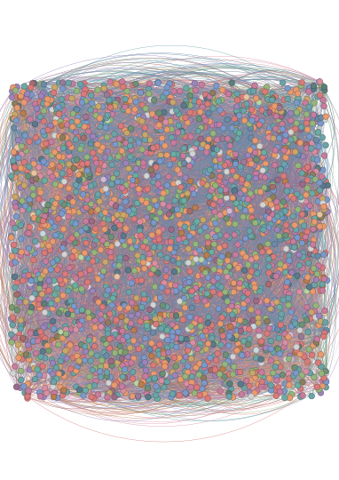
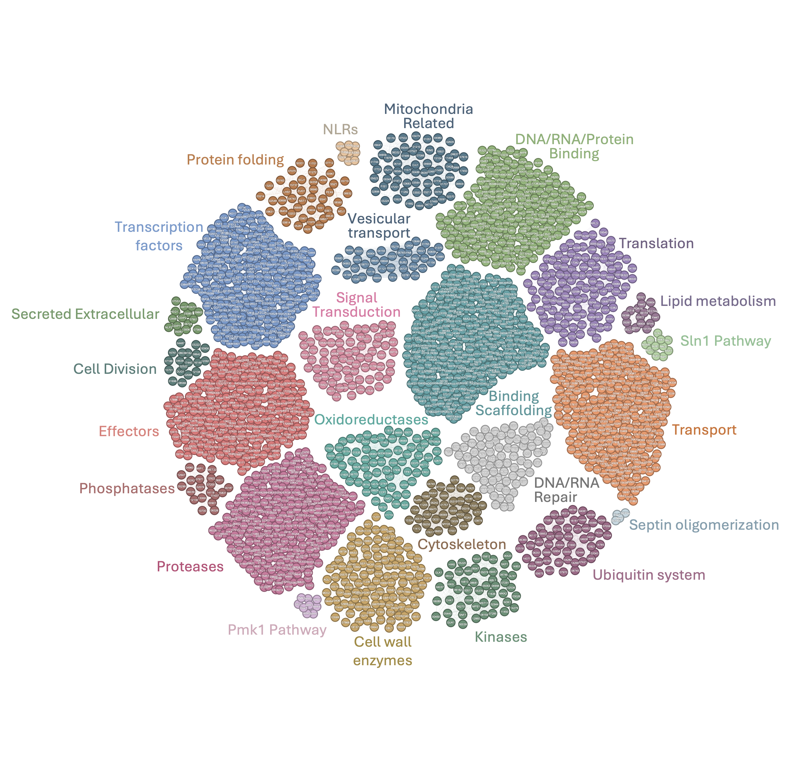
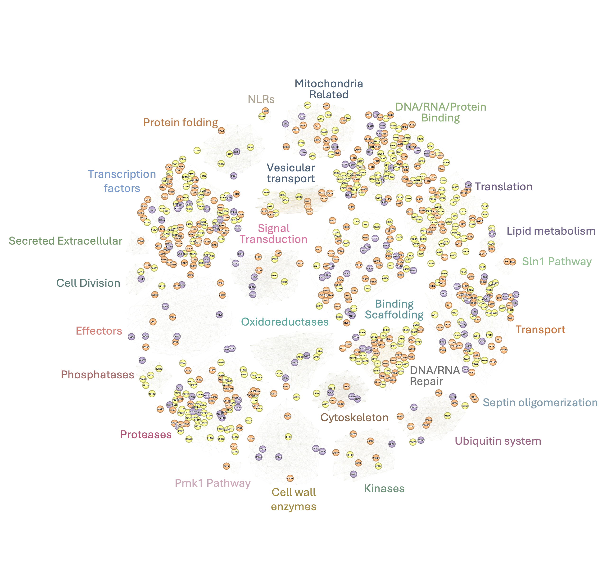
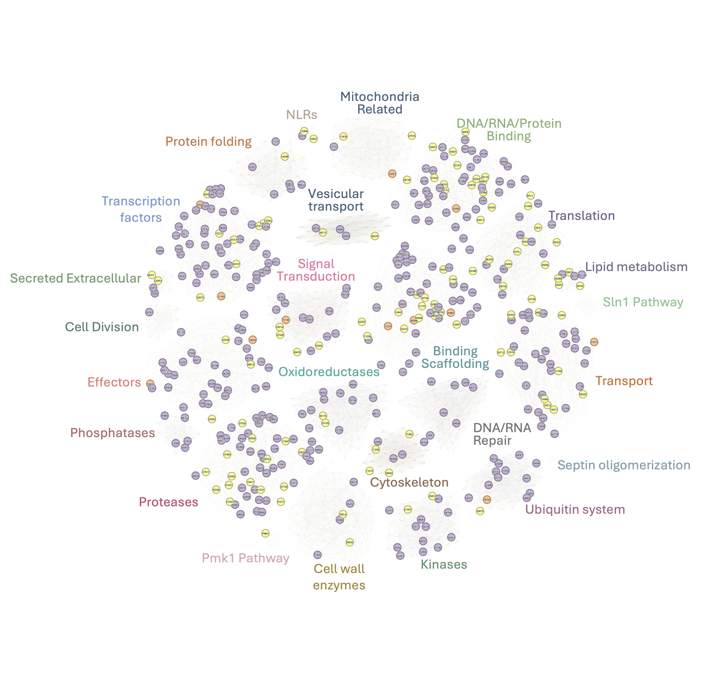
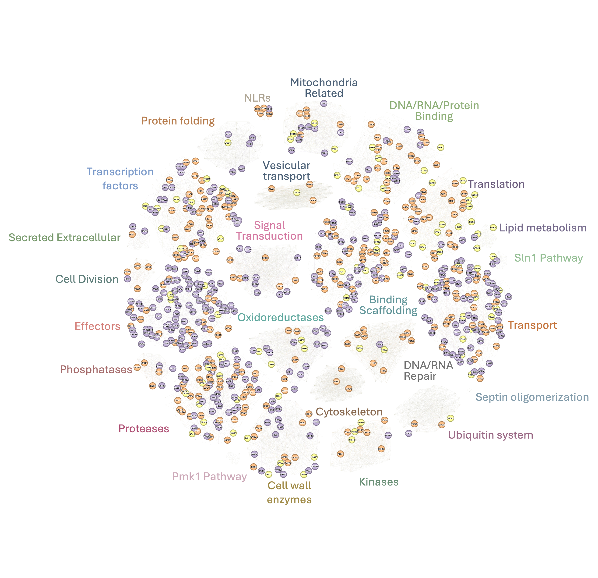
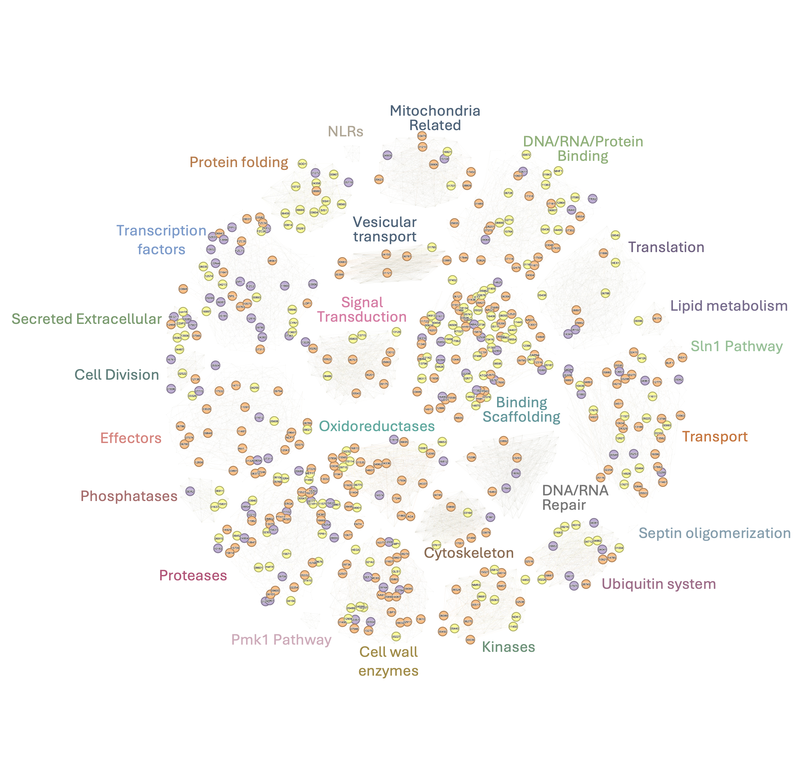
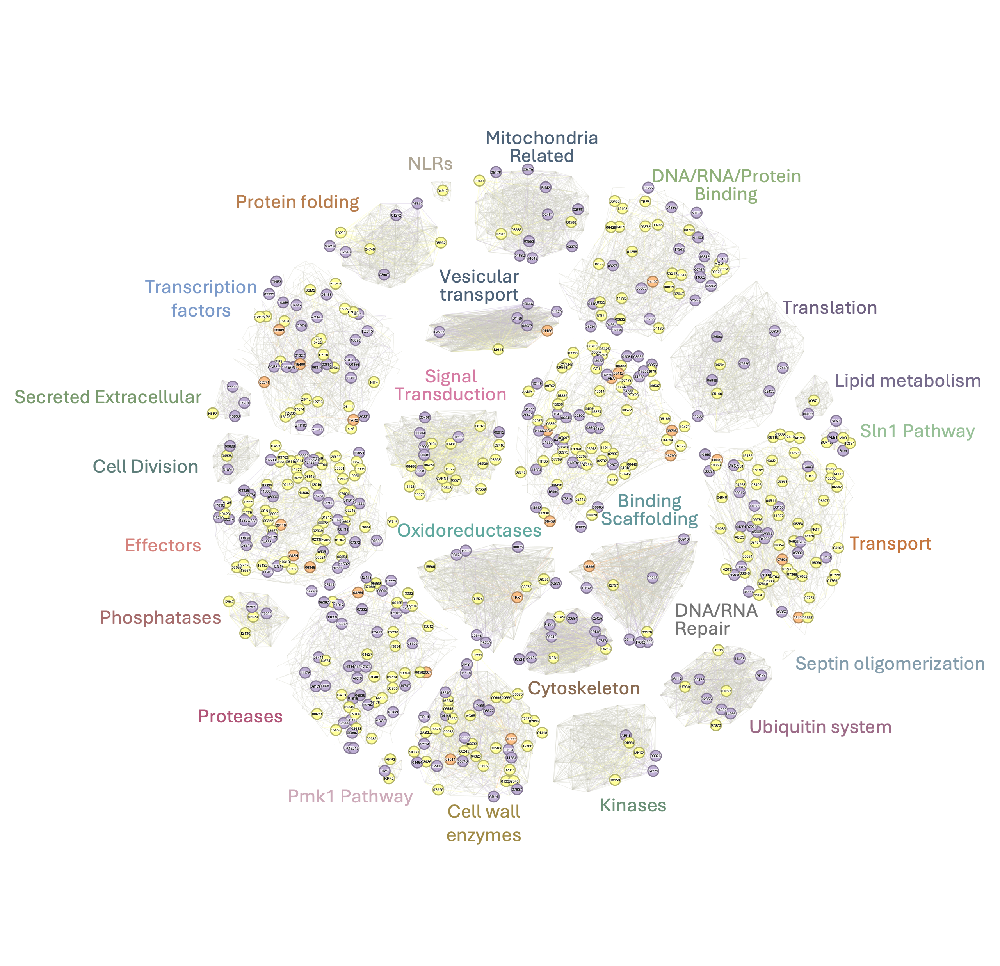
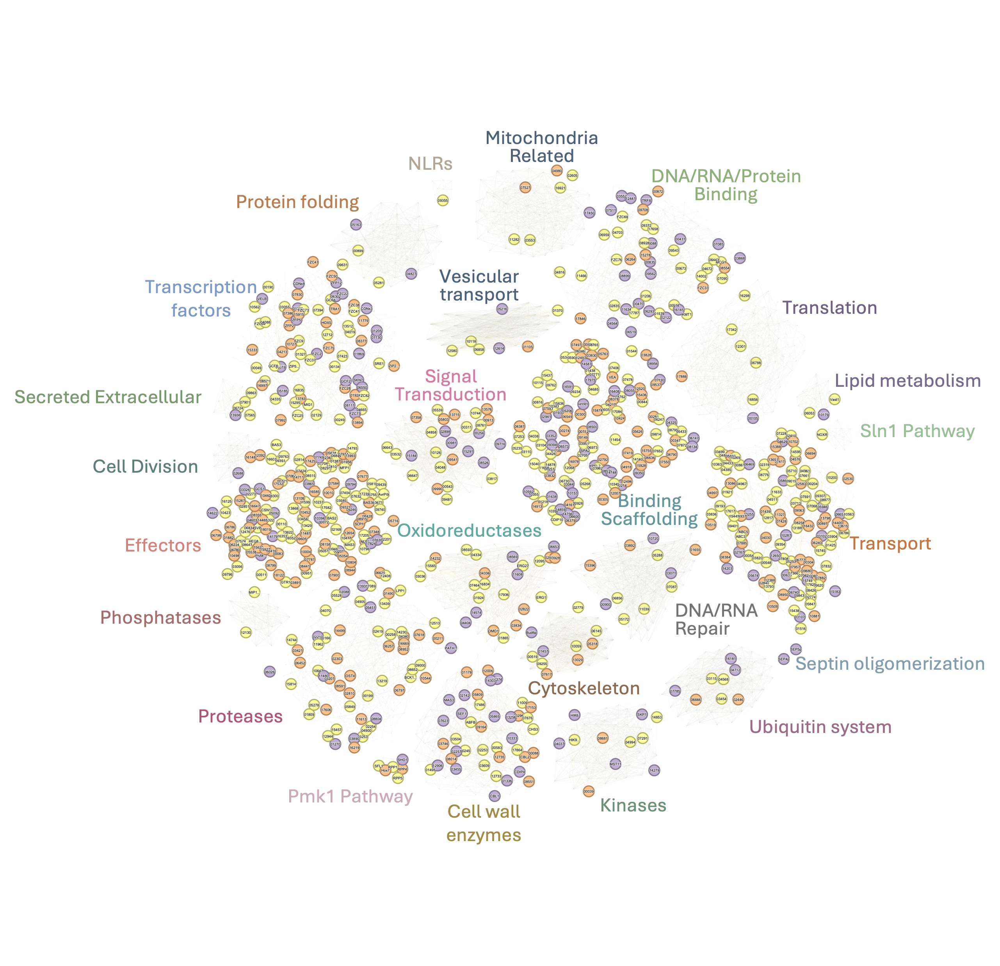

```{r setup, include=FALSE}
library(here)
source(here("scripts","analysis_config.R"))
init_analysis("005_gene_networks")

knitr::opts_chunk$set(
  fig.path="../data/results/005_gene_networks/00_figures/"
)
```

# Description

Camilla wants to have a visual summary of which gene functions are
coming up most among the DEGs and if their expression is co-regulated by
bip1 and mst12 OR is specific.

For this we discussed and planned on creating networks . I will first
create the base network file in GEXF format for import into Gephi, where
it will be visualized with various layouts.

## GoHREP

**Goal:**

To prepare gene function networks from DEGs from this project and see
their temoral profiles during in planta infection, and to identify key
hubs that may coordinate virulence functions over the time course.

**Hypothesis:**\
We think that based on the protein domains, their will be hubs of
different functions of genes expressed during specific stages of plant
infection that work together to suppress host immunity and/or facilitate
pathogen colonization. We also think there will be with a hub of
effectors playing central roles in coordinating virulence.

**Rationale:**\
Network analysis of differentially expressed genes when annotated
broadly into functional categories based on InterPro domains and known
characterized gene info can reveal groups of gene that may act together
over the time course to coordinate pathogenicity or virulence-related
functions.

**Experimental plan:**

1.  Discuss and create a broad fucntional annotations file with Cami -
    using the protein domain information from InterPRo annotations, and
    other known pathways in Magnaporthe. This file will be saved at
    `data/processed/network_base_manual.tsv`

2.  Generate a network file of DEGs based on RNA-seq data across bip1
    and mst12 samples.

3.  Import the gexf file to be further used in Gephi and plot various
    networks based on time points

## Load Required Packages

```{r load-packages}
library(tidyverse)
```

## Network layout

Base network colored based on functional categories

```{r}
dat <- read_tsv(here("data/processed/network_base_manual.tsv")) %>%
  filter(!Function_broad_final %in% c("other_unknown","uncharacterized","metabolic_enzymes")) # remove categories which have more than 300 genes, to avoid skewing the netwrok
unique(dat$Function_broad_final)


dat <- dat %>%
  filter(!is.na(Id),trimws(Id) != "",
         !is.na(Function_broad_final),  trimws(Function_broad_final)  != "") %>%
  mutate(Function_broad_final = trimws(Function_broad_final),
         Id = trimws(Id))

# Assign colors for the various functional categories - Used ChatGPT to generate color-blind friendly palette

palette <- c(
  "binding_scaffold_other"         = "#6BA3A8",
  "transport"                      = "#E89B6F",
  "signal_transduction"            = "#C77D9E",
  "transcription_factor"           = "#7B9ACA",
  "effector"                       = "#D97B7B",
  "dna_rna_protein_binding"        = "#95B57D",
  "cell_wall_enzymes"              = "#C9A76B", 
  "translation_ribosome"           = "#9B85BA",
  "oxidoreductases"                = "#6BADA3", 
  "proteases_peptidases"           = "#D88FA3",
 
  "mitochondria_related"           = "#5A7A8C", 
  "ubiquitin_proteasome"           = "#9C6B87",
  "kinases"                        = "#6D9178",
  "protein_folding_chaperones"     = "#B87D50", 
  "cytoskeleton"                   = "#8C7D5E", 
  "vesicular_transport"            = "#6B8BA8", 
  "phosphatases"                   = "#A66D6D", 
  "cell_division"                  = "#5E7E7A",
  "lipid_metabolism"               = "#9A7B97", 
  "secreted_extracellular"         = "#7A9A6E", 

  "sln1_pathway"                   = "#B8D4A8", 
  "nlrs"                           = "#E8C5A0", 
  "pmk1_pathway"                   = "#D4B8D8", 
  "septin_oligomerization"         = "#C8D8E0"
)

# hex buidler
hex2rgb <- function(hex) {
  h <- gsub("#", "", hex)
  as.integer(c(strtoi(substr(h, 1, 2), 16L),
               strtoi(substr(h, 3, 4), 16L),
               strtoi(substr(h, 5, 6), 16L)))
}

# Build edge table (shared Function_broad_final) 
# Two proteins are joined by an edge when they belong to the
# same functional group.  Groups with > 25 members would
# produce a lot edges each, so we random-sample
# MAX_EDGES_PER_GROUP pairs instead (for this I used 800 to make the hub edges a bit more denser - number of nodes will not be affected by this).  If this number is raised the network will show denser intra-group connections. If number is reduced, layout will be speedy with less connections.

MAX_EDGES_PER_GROUP <- 800
set.seed(148)

edge_list <- lapply(
  split(dat$Id, dat$Function_broad_final),
  function(pids) {
    n <- length(pids)
    if (n < 2) return(NULL)

    if (n * (n - 1) / 2 <= MAX_EDGES_PER_GROUP) {
      # small group  →  full clique
      idx <- combn(n, 2)                        # 2 × C(n,2)
      data.frame(source = pids[idx[1, ]],
                 target = pids[idx[2, ]],
                 stringsAsFactors = FALSE)
    } else {
      # large group  →  random sample of pairs
      pairs <- t(replicate(MAX_EDGES_PER_GROUP, sample(pids, 2)))
      data.frame(source = pairs[, 1],
                 target = pairs[, 2],
                 stringsAsFactors = FALSE)
    }
  }
)

edges <- do.call(rbind, edge_list)

# deduplicate undirected edges (A→B==B→A)
edges <- edges %>%
  mutate(s = pmin(source, target),
         t = pmax(source, target)) %>%
  distinct(s, t) %>%
  dplyr::rename(source = s, target = t)

# this will give a warning if any Function_broad_final is missing from palette
missing_cats <- setdiff(unique(dat$Function_broad_final), names(palette))
if (length(missing_cats) > 0) {
  warning("These categories have no colour assigned and will appear grey:\n  ",
          paste(missing_cats, collapse = "\n  "))
  # fill missing with a neutral grey so the code and network doesnt crash
  missing_hex <- rep("#D3D3D3", length(missing_cats))
  names(missing_hex) <- missing_cats
  palette <- c(palette, missing_hex)
}

# Create GEXF XML
# Node elements (one per protein)
node_fmt <- paste0(
  '    <node id="%s" label="%s">\n',
  '      <attvalues>\n',
  '        <attvalue for="0" value="%s"/>\n',
  '      </attvalues>\n',
  '      <viz:color r="%d" g="%d" b="%d"/>\n',
  '    </node>'
)

node_blocks <- mapply(function(pid, func) {
  rgb <- hex2rgb(palette[func])
  sprintf(node_fmt, pid, pid, func, rgb[1], rgb[2], rgb[3])
}, dat$Id, dat$Function_broad_final, SIMPLIFY = TRUE)


# Edge format: added label, type, and weight attributes
edge_fmt <- '      <edge id="%s" label="%s" source="%s" target="%s" type="undirected" weight="1.0" />'
eids        <- as.character(seq_len(nrow(edges)))  # IDs as strings, starting from 1
edge_blocks <- mapply(function(eid, src, tgt) sprintf(edge_fmt, eid, eid, src, tgt),
                      eids, edges$source, edges$target, SIMPLIFY = TRUE)
# write and save the file
gexf_xml <- paste0(
  '<?xml version="1.0" encoding="UTF-8"?>\n',
  '<gexf xmlns="http://www.gexf.net/1.3" ',
        'xmlns:viz="http://www.gexf.net/1.3/viz" version="1.3">\n', 
  '  <meta lastmodifieddate="', Sys.Date(), '">\n',
  '    <creator>R</creator>\n',
  '  </meta>\n',
  '  <graph defaultedgetype="undirected">\n',
  '    <attributes class="node" mode="static">\n',
  '      <attribute id="0" title="Function_broad_final" type="string"/>\n',
  '    </attributes>\n',
  '    <nodes>\n',
       paste(node_blocks, collapse = "\n"), "\n",
  '    </nodes>\n',
  '    <edges>\n',
       paste(edge_blocks, collapse = "\n"), "\n",
  '    </edges>\n',
  '  </graph>\n',
  '</gexf>\n'
)

writeLines(gexf_xml, here("data/results/005_gene_networks/","gephi_network.gexf"))

cat("✓  gephi_network.gexf written\n",
    "   Nodes :", nrow(dat),  "\n",
    "   Edges :", nrow(edges), "\n")

```

This is the raw netowrk, and will look like a blob when opened in
Gephi - as shown below:



## Base Network

This network was then force directed based on the ForceAtlas2 layout
parameters run, the set layout was saved at
`data/results/005_gene_networks/01_network_with_genenames.gexf.gephi`.
Since Gephi doesn't allow adding text/annotations outside the nodes, I
added the functional categories for the network hubs in powerpoint.



## Mapping differentially expressed genes on the Base Network

The above network was the base network layout that was then used to
visualize different categories of upreg and downreg genes (all performed
on Gephi using the node sizing option). The information required for
sizing the nodes is saved at
`data/processed/network_base_manual_with_degs.tsv`. The set layout with
node sizing info for DEGs (in data laboratory) was saved at
`data/results/005_gene_networks/02_network_fin.gexf.gephi`.

For showing the regulation in Bip1, Mst12 or both, I used the colors
consistent with previous analyses:

```{r eval=F}
Differentially regulated in Dbip1="#fdc086"
Differentially regulated in Dmst12="#beaed4"
Differentially regulated in Both Dbip1 and Dmst12 : "#ffff99"
```

### Downreg in Guy11 at 0h (Upregulated in Bip1/Mst12 at 0h)




### Downreg in Guy11 at 4h (Upregulated in Bip1/Mst12 at 4h) 




### Downreg in Guy11 at 24h (Upregulated in Bip1/Mst12 at 24h) 




### Upreg in Guy11 at 0h (Downregulated in Bip1/Mst12 at 0h)




### Upreg in Guy11 at 4h (Downregulated in Bip1/Mst12 at 4h)




### Upreg in Guy11 at 24h (Downregulated in Bip1/Mst12 at 24h)



```{r}
sessionInfo()
```
