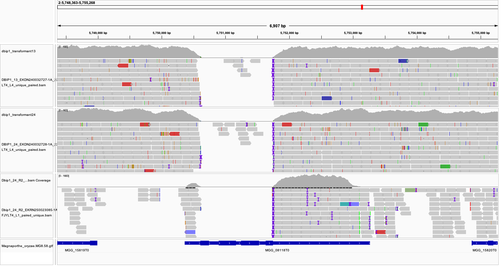

WGS Knockout Confirmation of bip1 Gene Deletions
================
Neha Sahu
29 April, 2026

- [Load required libraries](#load-required-libraries)
- [Description](#description)
  - [Prerequisites](#prerequisites)
  - [Data upload](#data-upload)
  - [FASTQ to Multiple BAM
    Conversion](#fastq-to-multiple-bam-conversion)
    - [SAM Flag Reference](#sam-flag-reference)

# Load required libraries

# Description

Scripts for validation of gene deletions for **bip1** gene in
*Magnaporthe oryzae* from whole genome sequencing (WGS) data with
SAMtools flag filtering. The goal here to have different filtered bam
files to distinguish between complete gene deletions or partial
deletions or mapping artifacts. TL;DR - this is to processes raw
paired-end FASTQ files through multiple filtered BAM files using
SAMtools flag filtering.

## Prerequisites

- **Access to HPC** - Norwich Biosciences Institute/The Sainsbury
  Laboratory HPC system or any other
- **Raw WGS sequencing data** (paired-end FASTQ files) - from sequencing
  provider (e.g., Novogene)
- ***Magnaporthe oryzae*** **reference genome** (MGGv8_genome.fasta)
  from [Ensembl
  fungi](https://fungi.ensembl.org/Magnaporthe_oryzae/Info/Index)
- ***Magnaporthe oryzae*** **GTF/GFF3 annotation file** - from [Ensembl
  fungi](https://fungi.ensembl.org/info/data/ftp/index.html)
- **IGV software** installed locally

## Data upload

Raw sequencing results (fastq files) were uploaded to
<https://sequences.tsl.ac.uk/> by Cami. There were two transformants for
this project:

1.  /tsl/data/reads//ntalbot/wgs_bip1_ko_mgg_08118_guy11/wgs_bip1_ko_mgg_08118_guy11/\_bip1_ko_t24_guy11/
    \# transformant_24
2.  /tsl/data/reads//ntalbot/wgs_bip1_ko_mgg_08118_guy11/wgs_bip1_ko_mgg_08118_guy11/bip1_ko_t13_guy11/
    \# transformant_13
3.  

## FASTQ to Multiple BAM Conversion

Ran the script provided at
`scripts/006_wgs_knockout/004_fastq_to_bam_filtered.sh`

### SAM Flag Reference

SAM flags are bit-wise flags that encode information about each read.
More details can be found at
<https://samtools.github.io/hts-specs/SAMv1.pdf> (Page 7).

Here are the key flags used in this pipeline:

| Flag  | Hex  | Description   | Meaning                                      |
|-------|------|---------------|----------------------------------------------|
| 0x1   | 1    | PAIRED        | Read is paired                               |
| 0x2   | 2    | PROPER_PAIR   | Read mapped in proper pair (both read files) |
| 0x100 | 256  | SECONDARY     | Secondary alignment                          |
| 0x800 | 2048 | SUPPLEMENTARY | Supplementary alignment                      |

From these outputs, I checked the region for bip1 gene - MGG_08118 in
`proper_paired` files on IGV - also checked the secondary alignments -
these had no reads on the bip1 region. Also used a bam file from the RNA
seq sample (Dbip1 replicate number 2 at 24h)



``` r
sessionInfo()
```

    ## R version 4.3.1 (2023-06-16)
    ## Platform: aarch64-apple-darwin20 (64-bit)
    ## Running under: macOS 15.7.5
    ## 
    ## Matrix products: default
    ## BLAS:   /Library/Frameworks/R.framework/Versions/4.3-arm64/Resources/lib/libRblas.0.dylib 
    ## LAPACK: /Library/Frameworks/R.framework/Versions/4.3-arm64/Resources/lib/libRlapack.dylib;  LAPACK version 3.11.0
    ## 
    ## locale:
    ## [1] en_US.UTF-8/en_US.UTF-8/en_US.UTF-8/C/en_US.UTF-8/en_US.UTF-8
    ## 
    ## time zone: Europe/London
    ## tzcode source: internal
    ## 
    ## attached base packages:
    ## [1] stats     graphics  grDevices utils     datasets  methods   base     
    ## 
    ## other attached packages:
    ##  [1] lubridate_1.9.4 forcats_1.0.1   stringr_1.6.0   dplyr_1.1.4    
    ##  [5] purrr_1.0.4     readr_2.1.5     tidyr_1.3.1     tibble_3.3.0   
    ##  [9] ggplot2_3.5.2   tidyverse_2.0.0 here_1.0.2     
    ## 
    ## loaded via a namespace (and not attached):
    ##  [1] gtable_0.3.6       compiler_4.3.1     tidyselect_1.2.1   dichromat_2.0-0.1 
    ##  [5] scales_1.4.0       yaml_2.3.10        fastmap_1.2.0      R6_2.6.1          
    ##  [9] generics_0.1.4     knitr_1.50         rprojroot_2.1.1    pillar_1.11.1     
    ## [13] RColorBrewer_1.1-3 tzdb_0.5.0         rlang_1.1.6        stringi_1.8.7     
    ## [17] xfun_0.52          timechange_0.3.0   cli_3.6.5          withr_3.0.2       
    ## [21] magrittr_2.0.3     digest_0.6.37      grid_4.3.1         rstudioapi_0.17.1 
    ## [25] hms_1.1.4          lifecycle_1.0.4    vctrs_0.6.5        evaluate_1.0.5    
    ## [29] glue_1.8.0         farver_2.1.2       rmarkdown_2.29     tools_4.3.1       
    ## [33] pkgconfig_2.0.3    htmltools_0.5.8.1
