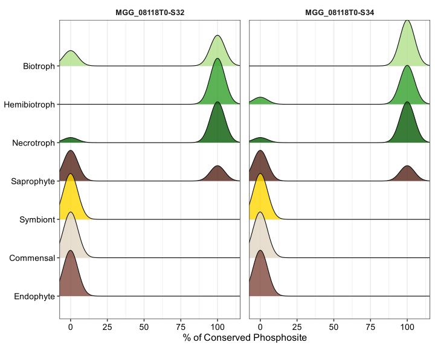
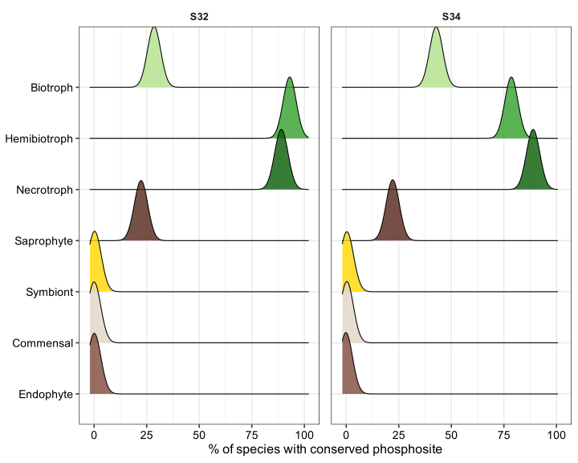

Conservation of phosphorylated sites from Bip1 in other fungi
================
Neha Sahu
28 April, 2026

- [Description](#description)
  - [Hypothesis](#hypothesis)
  - [Load Required Packages](#load-required-packages)
  - [Check phosphosites for Bip1
    gene](#check-phosphosites-for-bip1-gene)
    - [Session Information](#session-information)

# Description

Based on Nef’s pmk1 phosphoproteomics work, we found S32 and S34 as
phosphorylation sites on Bip1. These sites are thought to be regulated
by Pmk1, and/or during appressorium development, so they might have some
role in fungal pathogenicity. And we want to check the conservation of
Bip1 phosophorylation sites in fungi from various lifestyles.

## Hypothesis

If a phosphorylation site is functionally important, we would expect it
to be conserved across many related fungal species, particularly in
species that share a similar lifestyle (e.g., hemibiptrophs or any
another such plant pathogenic lifestyle). Moreover, if such a site is
absent in some lifestyles that are not pathogens, that would tell us
about whether it is linked to a specific ecological strategy.

In this analysis, we ask: across 42 fungal species with different
lifestyles, how often is each Bip1 phosphosite conserved? For this, I
used the orthogroups info from analyses in `001_orthologs` and
phosphosite conservation results from the new phoscon
(<https://github.com/nehasahu486/phoscon/tree/main>) pipeline.

## Load Required Packages

``` r
library(tidyverse)
library(ggridges)
```

## Check phosphosites for Bip1 gene

``` r
# ---- GOI ----
target_protein  <- "MGG_08118T0"
target_phos_site <- NULL         # e.g. "MGG_08118-S206"; NULL = all sites for that protein


# colors for annotations - same as Nef's paper
lifestyle_cols <- c(
  "Biotroph" = "#b2df8a",
  "Hemibiotroph" = "#33a02c",
  "Necrotroph" = "#075C07",
  "Saprophyte" = "#542519",
  "Symbiont" = "#ffd700",
  "Commensal" = "#e1d5c4",
  "Endophyte" = "#80493C"
)


all_lifestyles <- names(lifestyle_cols)

# Lifestyles info
species_annot <- read_tsv(here("data/raw/Lifestyle_42sps.tsv"),show_col_types = F)

# Read the results from phoscon
plot_df <- read_tsv(here("data/raw/phoscon_aggregated_by_species_42sps.tsv")) %>%
  filter(protein_id == target_protein) %>%
  { if (!is.null(target_phos_site)) filter(., phos_site_id == target_phos_site) else . } %>%
  left_join(species_annot, by = c("species" = "Species")) %>%
  filter(!is.na(Lifestyle)) %>%
  mutate(prop_conserved = if_else(is.na(prop_conserved) | prop_conserved < 0, 0, prop_conserved))

site_ids <- unique(plot_df$phos_site_id)
site_ids # phosphosites identified in bip1
```

    ## [1] "MGG_08118T0-S32" "MGG_08118T0-S34"

We use output from the phoscon pipeline that I ran previously in a
different project, TL;DR: phoscon uses aligned protein sequences across
species and checks whether each phosphorylatable residue (here, serine
S32 and S34 in Bip1) is present at the equivalent position in each
species. The result is a percentage conservation score per species: 100%
means the site is present, 0% means it is absent.

Based on Nef’s paper, the were two phosphosites identified in Bip1
(MGG_08118) - and these were S32 and S34.

Here, I want to visualize how each phosphosite is conserved across all
species within each lifestyle group. And plot them in a way that in
y-axis each row is a lifestyle, and the x-axis shows the % conservation
score (0% = site absent, 100% = site present). The shape of the ridge
depicts where most species in that group fall.

**Note on padding**: Some lifestyle groups had very few species (or none
at all) in the dataset that had the site conserved leading to empty
rows. To prevent empty rows in the plot from causing visual artefacts, a
small amount of artificial data (random values near 0%) was added for
missing lifestyle–site combinations. This does not affect biological
interpretation but was done just to show all seven lifestyles appear on
the y-axis.

``` r
padding_df <- expand.grid(
  phos_site_id = site_ids,
  Lifestyle    = all_lifestyles,
  stringsAsFactors = FALSE
) %>%
  anti_join(plot_df %>%
              dplyr::select(phos_site_id, Lifestyle) %>% distinct(),
            by = c("phos_site_id", "Lifestyle")) %>%
  dplyr::slice(rep(1:n(), each = 30)) %>%
  mutate(prop_conserved = rnorm(n(), mean = 0, sd = 0.5))

plot_df <- bind_rows(plot_df, padding_df) %>%
  mutate(Lifestyle = factor(Lifestyle, levels = rev(all_lifestyles)))

ggplot(plot_df, aes(x = prop_conserved, y = Lifestyle, fill = Lifestyle)) +
  geom_density_ridges(alpha = 0.8, scale = 1.2, rel_min_height = 0,
                      bandwidth = 5) +
  scale_fill_manual(values = lifestyle_cols, drop = FALSE) +
  scale_x_continuous(breaks = c(0, 25, 50, 75, 100)) +
  coord_cartesian(xlim = c(-2, 110)) +          # clips VIEW only, data intact
  facet_wrap(~phos_site_id, ncol = 2) +
  labs(x = "% of Conserved Phosphosite", y = NULL
  ) +
  theme_bw(base_size = 16) +
  theme(
    legend.position = "none",
    strip.background = element_rect(fill = "white", color = NA),
    strip.text = element_text(face = "bold"),
    panel.spacing = unit(1, "lines"),
    axis.text=element_text(size=14,color="black")
  )
```



#### How to read the above plot:

E.g. in S32 plots - Each ridge represents the distribution of
conservation scores for species in that lifestyle group

- Peak near 100% is when most species in that group have the phosphosite
  conserved (eg hemibiotophs)

- Peak near 0% is when most species in that group DO NOT have
  phosphosite conserved (eg symbiont, commensal, endophyte)

- Two peaks is when some species have it, some don’t (eg biotrophs,
  necrotrophs, saprotrophs)

The above plot shows the full distribution but can be noisy for small
groups. So, I now want to summarise the data as mean conservation value
per lifestyle, obtained directly from the phoscon output. I then
visualise these means as narrow ridges (simulated by jittering 80 points
around each mean with a small standard deviation) to allow side-by-side
comparison of S32 and S34.

``` r
all_lifestyles <- names(lifestyle_cols)

# Got this info from the phoscon results
tab <- tribble(
  ~Lifestyle,      ~S32,        ~S34,
  "Necrotroph",    88.8888889,  88.8888889,
  "Saprophyte",    22.2222222,  22.2222222,
  "Hemibiotroph",  92.8571429,  78.5714286,
  "Biotroph",      28.5714286,  42.8571429
)

tab_long <- tab %>%
  pivot_longer(cols = c(S32, S34),
               names_to = "phos_site_id",
               values_to = "prop_conserved")

# Add 0 for missing lifestyles
padding_means <- expand.grid(
  Lifestyle    = all_lifestyles,
  phos_site_id = unique(tab_long$phos_site_id),
  stringsAsFactors = FALSE
) %>%
  anti_join(tab_long, by = c("Lifestyle", "phos_site_id")) %>%
  mutate(prop_conserved = 0)

means_df <- bind_rows(tab_long, padding_means)

# Thicken each mean into many points around that value
set.seed(148)
plot_df <- means_df %>%
  group_by(Lifestyle, phos_site_id) %>%
  tidyr::uncount(weights = 80) %>%              # 80 pseudo‑points per mean
  mutate(
    prop_conserved = rnorm(
      n(),
      mean = prop_conserved,
      sd   = 1                                  # small spread around mean
    )
  ) %>%
  ungroup() %>%
  mutate(
    Lifestyle = factor(Lifestyle, levels = rev(all_lifestyles))
  )

ggplot(plot_df, aes(x = prop_conserved, y = Lifestyle, fill = Lifestyle)) +
  geom_density_ridges(
    alpha = 0.8,
    scale = 1.2,
    rel_min_height = 0,
    bandwidth = 3
  ) +
  scale_fill_manual(values = lifestyle_cols, drop = FALSE) +
  scale_x_continuous(breaks = c(0, 25, 50, 75, 100), limits = c(-2, 102)) +
  facet_wrap(~ phos_site_id, ncol = 2) +
  labs(x = "% of species with conserved phosphosite", y = NULL) +
  theme_bw(base_size = 16) +
  theme(
    legend.position  = "none",
    strip.background = element_rect(fill = "white", color = NA),
    strip.text       = element_text(face = "bold"),
    panel.spacing    = unit(1, "lines"),
    axis.text        = element_text(size = 14, color = "black")
  )
```



#### How to read this plot:

In the above plot, each ridge is very narrow and centered on a single
value which ranges between 0 to 100, thois is the mean % of species in
that lifestyle that have the phosphosite conserved.

Eg. Here we can see that S32 is more highly conserved than S34 in
hemibiotrophs, while both sites show more or less similar conservation
in necrotrophs ). This may suggest S32 has a broader role across fungal
pathogens, while S34 conservation is more lifestyle-specific. Based on
Camilla’s experiments, S32 was indeed important for pathogenicity, more
so than S34 in Bip1.

### Session Information

``` r
sessionInfo()
```

    ## R version 4.3.1 (2023-06-16)
    ## Platform: aarch64-apple-darwin20 (64-bit)
    ## Running under: macOS 15.7.5
    ## 
    ## Matrix products: default
    ## BLAS:   /Library/Frameworks/R.framework/Versions/4.3-arm64/Resources/lib/libRblas.0.dylib 
    ## LAPACK: /Library/Frameworks/R.framework/Versions/4.3-arm64/Resources/lib/libRlapack.dylib;  LAPACK version 3.11.0
    ## 
    ## locale:
    ## [1] en_US.UTF-8/en_US.UTF-8/en_US.UTF-8/C/en_US.UTF-8/en_US.UTF-8
    ## 
    ## time zone: Europe/London
    ## tzcode source: internal
    ## 
    ## attached base packages:
    ## [1] stats     graphics  grDevices utils     datasets  methods   base     
    ## 
    ## other attached packages:
    ##  [1] ggridges_0.5.7  lubridate_1.9.4 forcats_1.0.1   stringr_1.6.0  
    ##  [5] dplyr_1.1.4     purrr_1.0.4     readr_2.1.5     tidyr_1.3.1    
    ##  [9] tibble_3.3.0    ggplot2_3.5.2   tidyverse_2.0.0 here_1.0.2     
    ## 
    ## loaded via a namespace (and not attached):
    ##  [1] bit_4.6.0          archive_1.1.12     gtable_0.3.6       crayon_1.5.3      
    ##  [5] compiler_4.3.1     tidyselect_1.2.1   parallel_4.3.1     dichromat_2.0-0.1 
    ##  [9] scales_1.4.0       yaml_2.3.10        fastmap_1.2.0      R6_2.6.1          
    ## [13] generics_0.1.4     knitr_1.50         rprojroot_2.1.1    pillar_1.11.1     
    ## [17] RColorBrewer_1.1-3 tzdb_0.5.0         rlang_1.1.6        stringi_1.8.7     
    ## [21] xfun_0.52          S7_0.2.0           bit64_4.6.0-1      timechange_0.3.0  
    ## [25] cli_3.6.5          withr_3.0.2        magrittr_2.0.3     digest_0.6.37     
    ## [29] grid_4.3.1         vroom_1.6.5        rstudioapi_0.17.1  hms_1.1.4         
    ## [33] lifecycle_1.0.4    vctrs_0.6.5        evaluate_1.0.5     glue_1.8.0        
    ## [37] farver_2.1.2       rmarkdown_2.29     tools_4.3.1        pkgconfig_2.0.3   
    ## [41] htmltools_0.5.8.1
